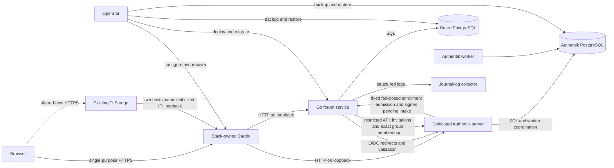

# Architecture

## Document control

| Field | Value |
| --- | --- |
| Status | Draft constrained by PRD 0.7 |
| Product | GOTTH Board |
| Applies to | Version 1.0 unless noted |
| Governing document | [Product requirements](prd.md) |

## 1. Decision summary

- Build a modular monolith in Go.
- Render HTML on the server with Templ.
- Use HTMX only for targeted page updates; every flow remains an ordinary HTTP
  request with server-side authorization and validation.
- Use Tailwind CSS for a compiled, static stylesheet.
- Use PostgreSQL as the only durable application store in version 1.0.
- Use Authentik OIDC as the only authentication authority.
- Keep registration policy, approval, local suspension, and Board sessions in
  Board; use Authentik only to execute credential enrollment, email
  verification, authentication, and exact Board-group eligibility.
- Store opaque, revocable sessions server-side.
- Model area visibility and posting mode as independent columns.
- Model each non-root post as an immutable reply to one earlier post in the
  same topic; presentation depth never substitutes for stored ancestry.
- Apply access predicates inside data-access queries and explicit write-policy
  checks.
- Deploy the version 1.0 release as one pinned Compose project that owns Caddy,
  the Go service, Authentik server/worker, and separate Board and Authentik
  PostgreSQL services; never combine their process or database lifecycles in
  one image.
- Prefer direct SQL, explicit transactions, and small interfaces over an ORM or
  generic policy framework.

## 2. System context



Caddy is the only application-specific proxy and owns routing for both
hostnames. It is the public TLS listener on a single-purpose host. On a
multi-site host, the existing public Caddy remains a thin TLS edge and forwards
only these two hosts to dedicated loopback listeners; the stack Caddy retains
its own configuration, state, and upstream policy.
The Go and Authentik HTTP processes bind to host-loopback upstreams. Authentik
is the identity authority but not the forum authorization authority. The Board
and Authentik use distinct PostgreSQL services and durable directories.

## 3. Architectural boundaries

### 3.1 Edge boundary

Caddy shall:

- Match the dedicated `bb.alhstudios.com` site.
- Proxy the request path unchanged to the application on loopback.
- Overwrite `X-Forwarded-For` with the immediate canonical client address and
  remove alternative `Forwarded`/`X-Real-IP` identities before proxying.
- Expose only intended application routes.
- Apply sensible request-body and timeout limits at the edge.

The application shall not derive its public origin or base path from incoming
forwarded headers. Both are trusted deployment configuration. This prevents a
client from manufacturing passwordless callback URLs, redirects, or links.

### 3.2 HTTP application boundary

The HTTP layer owns:

- Request parsing and size limits.
- Session loading.
- CSRF enforcement.
- Route-specific authorization calls.
- Validation error mapping.
- Full-page versus HTMX fragment selection.
- Response status, headers, redirects, and canonical links.

It does not own SQL or business transitions.

### 3.3 Application/service boundary

Small services coordinate use cases such as login callback, create topic, edit
post, change area access, and suspend member. Each mutation defines one
transaction boundary and one audit policy. Services accept typed inputs rather
than `http.Request`.

### 3.4 Policy boundary

Authorization is deliberately split:

1. Read repositories require an `AccessContext` and apply visibility in SQL.
2. Write services call explicit policy functions against the current actor and
   locked target rows.
3. HTTP middleware may reject obviously unauthenticated routes, but middleware
   is never the sole authorization control.

This avoids the classic failure where a topic page is protected but search,
counts, or an HTMX fragment leaks the same topic.

Registration uses the same ownership rule. Board stores the effective closed
mode. Each dedicated Authentik enrollment flow contains a conditional Deny
stage at entry, immediately before its first irreversible stage, and after
email verification but before Board-group assignment. The guard's policy makes
one fixed HTTPS GET to the corresponding public Board admission path. It
removes the Deny stage only for empty `204`; Board outage, policy-engine failure,
another status, a redirect, or malformed state executes the Deny stage and
cancels the flow. Critical write/verification stages carry no conditional
policy and therefore cannot be skipped on policy failure. The endpoint accepts
no body, identity, URL, or object selector and returns no policy detail. This is
a read-only availability dependency, not an administrative callback.

Approval enrollment performs a second fixed HTTPS POST only after Authentik
email verification. It carries one at-most-60-second JWT made by the dedicated
Board OIDC provider and containing exact issuer, audience, purpose, flow,
numeric Authentik user key, immutable user UUID, and bounded display/email
claims. Board verifies the provider algorithm/key, issuer, audience, purpose,
flow, expiry, and body size before an idempotent insert keyed by the immutable
user coordinates. Replays cannot reopen
a rejected or completed registration. No unsigned identity input becomes a
pending account.

Board's outbound Authentik client reads one root-owned API-token secret and is
hard-coded to the configured issuer origin and exact blueprint-provided object
identities. It rejects redirects, cross-origin locations, oversized bodies,
unknown JSON fields where the local projection requires closure, and ambiguous
timeouts. The token belongs to a service account without admin-interface
access. Global authority is limited to read-user and invitation create.
Authentik initial-permission rules assign view/delete only on invitations that
service account creates; group object authority is limited to view plus
add/remove user on the exact accepted, pending, and suspended Board groups. The client exposes no
generic method accepting a URL, HTTP verb, model name, or caller-owned object
identifier.

The OIDC callback also consults Board's pending state before issuing a local
session. Every non-approved pending state denies even if Authentik group state
is briefly permissive; an identity with no pending row follows ordinary
open/invitation JIT creation.

Cross-database access is forbidden. Board never connects to Authentik
PostgreSQL, and Authentik never connects to Board PostgreSQL. The signed intake,
read-only admission endpoint, and restricted HTTP API are the complete
cross-system mechanisms.

### 3.5 Repository boundary

Repositories contain SQL and row mapping. They do not return unrestricted
content for a caller to filter afterward. Repository interfaces are grouped by
use case rather than by one generic CRUD interface.

### 3.6 Rendering boundary

Templ components render typed view models. They do not query the database or
make authorization decisions. All URLs pass through one base-path-aware URL
builder. User Markdown is rendered and sanitized before it enters a Templ
component as explicitly typed trusted markup.

## 4. Request lifecycle

### 4.1 Read request

1. Caddy proxies the request path unchanged on loopback.
2. Middleware assigns a request ID, records bounded access evidence, recovers
   panics, sets defensive headers, and loads the opaque session cookie. The
   executable order is request ID → access log → recovery → application so a
   recovered panic is observed as a completed 500 without trusting an inbound
   request-ID header.
3. Session loading returns an anonymous or authenticated `AccessContext`.
4. The handler validates route parameters and calls a read repository.
5. The repository applies the area-access predicate in SQL.
6. A missing or unauthorized object returns the same not-found behavior.
7. The handler builds a typed view model.
8. Templ renders a full page or the documented HTMX fragment.

### 4.2 Mutation request

1. The common request lifecycle loads the actor.
2. CSRF validation runs before body processing with side effects.
3. The handler applies body limits, parses input, and returns field errors for
   invalid data.
4. The service starts a database transaction and locks the rows governing the
   transition.
5. The policy function evaluates the current actor and locked state.
6. The service performs the mutation and appends any required audit event.
7. The transaction commits once.
8. The response uses POST/Redirect/GET for ordinary forms. Successful HTMX
   mutations issue a same-origin `HX-Location` GET that swaps only the
   server-rendered `#main-content` region and updates browser history; login,
   revalidation, and other session-boundary transitions deliberately retain
   browser-level redirects.

Retries are not automatic for mutations unless the operation has an explicit
idempotency key or the failure is known to occur before commit.

## 5. Public path handling

The initial development deployment uses `https://bb.alhstudios.com`.
Routes begin at `/`. Other deployments may use another origin or a path prefix
without renaming the product.

The service receives two immutable settings:

- `PUBLIC_BASE_URL=https://bb.alhstudios.com`
- `BASE_PATH=` (an explicitly configured empty value)

`PUBLIC_BASE_URL` constructs absolute OIDC and canonical URLs. `BASE_PATH`
constructs browser-facing relative URLs and the session-cookie Path. Incoming
forwarded headers may be logged for diagnosis but cannot override these values.

No template, redirect, form action, HTMX target, asset reference, or canonical
link may hard-code a deployment path. All use the URL builder. Tests run the
same view and handler suite with an empty base path and non-empty prefixes to
expose hard-coded paths.

## 6. Identity architecture

### 6.1 Login

1. The login endpoint creates cryptographically random state, nonce, and PKCE
   verifier values and stores their hashes or protected values in a short-lived
   login-attempt record.
2. The browser is redirected to the configured Authentik authorization
   endpoint.
3. Authentik redirects to the exact configured callback URL.
4. The callback consumes the state once, exchanges the code, validates issuer,
   audience, signature, expiry, nonce, and PKCE, then extracts approved claims.
5. One transaction creates a new verified identity as a local member or updates
   an existing approved profile snapshot, preserves every existing forum-local
   role/group assignment, and creates a new server-side session.
6. The old anonymous/login cookie state is rotated away.

### 6.2 First-run administrator

The browser setup route is enabled only when the deployment supplies one exact
OIDC subject. A fresh install may direct an anonymous browser through the normal
OIDC login with `/setup` as the validated return path. The resulting local
member may view and submit setup only when its stored `(issuer, subject)` equals
the configured issuer and subject and the session has passed the ordinary
freshness check. Email, username, display name, registration order, and OIDC
role/group claims are never bootstrap authority.

The setup mutation requires the session-derived CSRF token and generated
request ID. One transaction locks the governance singleton, proves there is no
historical administrator-bootstrap audit and no active administrator, locks the
exact current session and designated identity, changes that user from member to
administrator, writes an immutable self-bootstrap audit, and revokes the
elevating session. After commit the browser cookie is expired and the user
authenticates again. Concurrent setup or operator attempts serialize at the
same governance lock; exactly one can commit. The existing operator executable
remains a non-browser fallback and obeys the same permanent-close test.

### 6.3 Authentik enrollment

The board owns no registration form or password. `GET /register` redirects to
one validated same-origin Authentik enrollment flow and supplies only the
board's absolute `/login` URL as its post-enrollment return. The deployment
blueprint creates users inactive, requires verified email before activation,
places new users in the dedicated `gotth-bb-users` group, and signs them into
Authentik only after verification. The board application is bound to that
group; the OIDC callback still creates only a local member.

"Board-only" describes application access, not a separate Authentik identity
store. Before enrollment is enabled, every other application in the shared
Authentik directory must have an explicit binding that excludes the board
group. Authentik's default access for an application with no bindings is open
to all users, so an unbound sibling application blocks activation. Deployments
requiring hard identity-store isolation use a separate identity authority.

### 6.4 Local account state

The forum stores display information for rendering and forum state for
operation. Authentik-sourced fields are distinguished from forum-owned fields.
A forum suspension never modifies Authentik. An Authentik disable does not
delete authored content.

### 6.5 Identity and local-authorization freshness

Version 1.0 does not store Authentik administrative credentials or user refresh
tokens. Approved profile claims are refreshed at successful authentication.
Forum roles and groups are local database state and are not derived from OIDC
claims. The maximum authenticated session lifetime and revalidation interval
are explicit settings.

When a protected request arrives after the revalidation interval, the existing
session does not authorize that request. The browser enters a short-lived OIDC
reauthorization flow. It may request noninteractive authorization where
Authentik's documented behavior permits it, but failure or required interaction
is shown honestly. Successful reauthorization refreshes identity/profile
state, creates a rotated session, and revokes the old session. Failure denies
the protected request; it never falls back to stale identity validation.

The configured interval therefore bounds stale Authentik disable state for
active protected use without storing long-lived Authentik tokens. Local role,
group, suspension, and mute state is loaded from PostgreSQL for protected
requests, so an audited local change takes effect without waiting for OIDC
reauthorization. The exact Authentik revalidation window is an owner decision
and no code may claim immediate disable propagation unless the deployed
integration actually provides and verifies it.

### 6.6 Logout

Local logout revokes the server-side session and expires the cookie. Optional
RP-initiated Authentik logout is a separate redirect after local revocation; a
failure at Authentik cannot resurrect the local session.

A logout request with stale CSRF state performs no revocation and expires no
cookie. It redirects to the application root with one fixed, application-owned
failure marker; the authenticated area index renders an explicit notice that
the user remains logged in and must retry. The marker is never interpreted as
proof that logout occurred.

## 7. Authorization architecture

### 7.1 Access context

An `AccessContext` contains only the facts needed to authorize the current
request:

- Authentication status.
- Local user ID.
- Effective role.
- Current forum-local group IDs.
- Local suspension/mute state.
- Session validation timestamp.

### 7.2 Area visibility predicate

Conceptually, a row is visible when:

```text
role is moderator-or-admin
OR visibility is public
OR authenticated member AND visibility is authenticated
OR authenticated member AND visibility is groups
   AND member groups intersect area groups
```

The actual SQL shall use parameters and indexed relations. It shall not build
SQL from group names or role strings.

### 7.3 Posting predicate

Publishing additionally requires:

- An authenticated, non-suspended member.
- Visibility access.
- `posting_mode = normal`, unless the actor is moderator-or-admin.
- An unlocked topic for replies, unless the actor is moderator-or-admin.
- Applicable mute and rate-limit checks.

Archived areas reject publishing for every actor until an administrator
restores the area; moderators do not bypass archival state accidentally.

### 7.4 Elevated access

Moderator and administrator reads of restricted areas are required for global
moderation in version 1.0. The UI must identify elevated context where
practical. Mutations require reasons where the action changes visibility,
identity access, or content history.

## 8. Data architecture

### 8.1 Core relations

- `users`: local identity, profile snapshot, role, suspension state, timestamps,
  and forum-administration revision.
- `external_identities`: OIDC issuer and subject, unique as a pair.
- `governance_state`: one singleton row used only to serialize bootstrap and
  administrator-continuity checks.
- `forum_groups`: locally administered groups, stable local identifiers, and
  administration revision.
- `forum_group_members`: audited local user-to-group membership.
- `sessions`: hashed opaque token, user, issued/expiry/validation timestamps,
  revocation state, and minimal client audit fields.
- `oidc_login_attempts`: short-lived, one-time state/nonce/PKCE records.
- `site_settings`: one bounded presentation/rules/control singleton with an
  administration revision, registration and maintenance modes, publication
  policy, and session-policy values constrained by deployment ceilings.
- `pending_registrations`: bounded Authentik identity coordinates and closed
  pending/approved/rejected state, with no password or token material.
- `registration_invitations`: one bounded local operation/idempotency record
  per requested invitation, with closed transition/delivery state and no remote
  invitation UUID/link or plain recipient.
- `users.authentik_sync_state` and the pending-registration transition columns:
  one current restrictive cross-system state per affected identity; this is
  operational truth, not an audit substitute.
- `email_test_state`: bounded idempotency/rate/status state for tests sent
  only to the requesting administrator's current verified address; no address
  or body is stored.
- `areas`: hierarchy-free version 1.0 category, visibility, posting mode, order,
  and administration revision.
- `area_groups`: local groups allowed to view a group-restricted area.
- `topics`: area, author, title, state, activity pointers, counters.
- `posts`: topic, author, stable number, Markdown source, sanitized rendering,
  revision, and soft-deletion state.
- `topic_reads`: per-user last-read position.
- `reports`: reporter, exactly one target, reason, state, assignment, resolution.
- `report_notes`: append-only staff notes attached to one report.
- `user_warnings`: append-only warnings attached to one local account.
- `moderation_actions`: append-only audit record.
- constant-size publication-window state on `users`; version 1.0 stores no
  rate-limit event ledger.

### 8.2 Identity constraints

Issuer and subject are immutable identity coordinates. Email and display name
are mutable attributes. External identity conflicts fail closed and require an
operator-visible error; they are never silently merged.

### 8.3 Content constraints

An area owns topics; a topic owns posts. A topic is created with post number 1
in one transaction. Reply numbering and activity pointers update while the
topic row is locked, preventing duplicate numbers and lost counters.

Each topic is also one rooted adjacency tree. The first post has no parent.
Every later post names one earlier parent in the same topic. Immutable post
numbers remain the chronological identity and unread watermark; the reply
tree controls conversational presentation. A bounded materialized tree path
derived from immutable post numbers supports deterministic depth-first reads
without a recursive full-topic scan on every page. The parent and path are
immutable together and database-validated.

Posts keep Markdown source as canonical content. Sanitized HTML may be stored
as a derived cache with a renderer-version marker. A renderer change can rebuild
the cache from source. Before Alpha.3 installs its writer constraint, the
ordinary release command classifies every existing post through bounded
read-only transactions of at most 100 rows using the same renderer rules as the
mutating pass. The snapshots are batch-bounded, but total preflight rendering,
transactions, and round trips grow with the complete post population.
The application stop/drain, not a fake atomic claim, protects traversal across
those snapshots and the gap before schema apply. Alpha.3 then performs the
rebuild through release-owned, bounded batch transactions. The singleton owns
a nullable `last_processed_post_id`: `NULL` means before every possible bigint
identity, including `MinInt64`. Initial and cursor-bearing selections use
separate SQL statements: the initial shape has no cursor predicate, while the
cursor shape exposes a direct primary-key lower bound. This keeps `id > cursor`
as an index condition even after pgx prepares the statement and PostgreSQL
chooses a generic plan; a nullable `cursor IS NULL OR id > cursor` predicate is
not used. Each batch locks only its selected stale post rows plus the singleton
renderer-state row that serializes competing runners,
renders current canonical source, updates only those locked identities, and
atomically commits the last selected ID and converted count before selecting
more. A rollback advances nothing; an unknown commit outcome is resolved by
the persisted cursor on restart. The schema installs a `NOT VALID` writer
constraint that immediately rejects obsolete-version inserts and updates while
the application is stopped and old rows are rebuilt. The schema transaction
does not scan `posts`; the later final empty batch validates that constraint by
scanning the complete table under `SHARE UPDATE EXCLUSIVE` while retaining the
renderer-state row lock, then records completion. A legacy row whose exact
admitted p1 HTML would exceed the unchanged persistence limit under p2 keeps
that verified p1 HTML under an
explicit p1-preserved compatibility marker. Every other row moves to p2, and
every other failure stops the batch. The final whole-table oracle remains
authoritative even after the cursor reaches the end. Readiness checks the exact
completed target, cursor column/constraint shape, and validated catalog
constraints in constant-shaped SQL. Per-batch
logging is absent; durable database state is the sole progress record. Restarting
the migration safely resumes after the last committed identity without
rescanning the converted prefix.

### 8.4 Soft deletion and audit

Soft-deleted content retains identity and moderation context but is hidden from
ordinary readers. Audit events capture state transitions rather than mutable
prose logs. Hard purge follows a separate retention procedure and must not
silently break referential or audit integrity.

## 9. Transactions and concurrency

- Login callback: identity upsert, groups, role, and session in one transaction.
- Topic creation: topic, first post, and area/topic counters in one transaction.
- Reply creation: lock topic, lock and validate the visible parent in that
  topic, verify state, allocate number, derive the immutable tree path, insert
  the post, and update activity in one transaction.
- Post edit: use a revision number to detect stale concurrent edits.
- Area access change: update policy and append audit event in one transaction.
- Role/suspension change: lock the singleton governance row and target, define
  active administrator as administrator role without an effective suspension,
  reject a transition leaving zero active administrators, and append audit in
  one transaction.
- Moderation mutation: lock target, transition state, append audit event in one
  transaction.
- Report submission: lock the reporter, enforce the active-report cap, prove
  target visibility in SQL, and insert one active report in one transaction.
- Report processing: lock the report, enforce self-claim and strict terminal
  transitions, then append the audit event in the same transaction as the
  assignment, note, resolution, or dismissal.
- Registration-policy change: lock the settings singleton, validate the
  deployment ceilings and positive revision, update the closed mode, and append
  one audit event. Authentik flow admission reads that committed row directly;
  there is no asynchronously copied permissive mode.
- Approval/rejection: a short first Board transaction locks the pending row,
  records one restrictive intent plus request audit/idempotency key, and
  commits. Authentik group work and readback then run without any PostgreSQL
  transaction or lock. A short second Board transaction verifies the same
  intent/key and records the terminal state plus completion audit. Failure
  leaves a retryable restrictive intent; it never fabricates completion or
  lets a competing transition overtake the committed intent.
- Pending-intake recovery: the administrator page may list at most 51 users
  through an exact pending-group filter. An expiring server-authenticated
  handle selects one projected identity for a POST which re-fetches and
  revalidates exact pending membership before an idempotent local insert. A GET
  never repairs state, and an Authentik outage does not hide already-local rows.
- Suspension: commit the existing local suspension and all-session revocation
  first; Authentik accepted-group removal follows as a recorded reconciliation.
  Local denial remains authoritative during failure. Reinstatement reverses the
  order: verified Authentik eligibility first, then the guarded local
  reinstatement transaction.
- Finite-suspension expiry: one advisory-lock-serialized worker tick claims at
  most five due identities without retaining a database lock, restores and
  verifies Authentik accepted membership, then marks local sync accepted in a
  second transaction. Until that completion, the ordinary authorization query
  denies non-accepted sync state even after the wall-clock suspension expires.
- Session revocation: lock and revalidate the administrator and selected local
  session or target account, set finite revocation time, and append one audit in
  the same Board transaction. A server-authenticated action handle, not a raw
  cookie or hash, selects a single session.
- Invitation create/revoke uses the same local-intent, remote-call, local-
  completion phases and a unique non-secret remote object name. Retry adopts
  only an exact request-fingerprint and remote-object match; a mismatch blocks. The invitation UUID
  and link remain ephemeral bearer material rather than Board database state.
  A missing single-use object is recorded only as absent/consumed-or-removed;
  only Board's confirmed delete is called revoked.
- Email test: reserve one idempotency/rate slot in Board before the external
  call, send through the same host-managed SMTP transport as Authentik, and
  store only accepted/failed/unknown state plus finite timestamps. Unknown is
  never retried automatically because SMTP may already have accepted the
  message.

Report-detail reads prove current persisted staff authority in both the detail
and notes queries. The notes query returns an explicit authorized empty
sentinel, so a role, suspension, or mute change between the two reads fails the
whole response closed instead of turning revocation into an empty-notes page.

Database constraints remain authoritative. Application checks improve errors
but do not replace uniqueness, foreign keys, check constraints, and transaction
isolation.

## 10. Feature data paths

### 10.1 Search and recent activity

PostgreSQL 17 full-text search is sufficient for version 1.0; `gotth-search`
remains a placeholder and no external service enters the data path. AN-02 owns
three optional-session reads: `/search`, `/activity`, and the primary-key-started
`/posts/{postID}` target. The existing global navigation links the first two.

Search treats topic titles and post bodies as distinct typed documents. The
admitted renderer produces sanitized HTML and normalized visible text at one
boundary; only that visible text becomes a post vector or excerpt input. Topic
vectors derive from titles. Projection identity binds renderer/visible-text,
NFC/Unicode, PostgreSQL-major, and the fully qualified `pg_catalog.simple`
configuration. A changed identity requires stopped preflight and complete
rebuild, not a mixed projection. Minor PostgreSQL upgrades compare every stored
vector under the candidate server; a fixture sample is not corpus proof.

Authorization is relational, not a post-filter. Each topic and post candidate
branch joins its area/topic context and applies the canonical visitor/member/
group/staff predicate before text matching can enter the 51-row search fence,
the 26-row activity limit, ranking, counting, excerpt work, or terminality.
`area_groups` is only an `EXISTS` semi-join. The selected search page rechecks
the same predicate and projection marker inside one read-only repeatable-read
transaction. A mismatch fails the buffered response closed; it does not fill a
page with a weaker query. Restricted data never enters a shared anonymous
cache.

Search first materializes at most the newest 51 authorized typed identities,
with root-post deduplication before that limit. It uses row 51 only as the
`50+` sentinel. Text ranking orders the first 50 candidates; author-only search
retains newest-first order. This makes the cost and the UI claim agree: rank is
local to a bounded recent set, not a fictional global optimum.

Activity keysets on immutable `(posts.created_at, posts.id)` and authorizes
inside the same SQL shape before `LIMIT 26`. Its fixed authenticated cursor
carries only the boundary, database-issued time, key identity, and a 16-byte
digest of the server-owned access snapshot. A 32-byte HMAC covers the complete
binary record. PostgreSQL `clock_timestamp()` in the read transaction decides
the 24-hour lifetime and key issuance window, preserving ordinary automatic
restart without process-local monotonic state. Cursor-key expiry affects only
activity issuance; it cannot close global readiness or unrelated routes.

One process-local non-waiting semaphore of two bounds search/activity database
work, response buffers, and slow writes. Each handler buffers at most 256 KiB
before committing headers, ends its database checkout before network output,
and holds the permit through the bounded write. Search gets one five-second
work context and activity two seconds. PostgreSQL statement, lock, work-memory,
parallel, and JIT settings schedule bounded cancellation but are not misrepresented
as hard CPU, RSS, I/O, or backend-disappearance limits.

Migration 000008 adds nullable vector/version columns, a restart-safe
topic-then-post projection singleton, six `NOT VALID` checks over existing
rows, five exact partial indexes, and narrower deferred consistency-trigger
events. The stopped release preflight validates every row before schema apply.
Backfill commits batches of at most 100 with singleton/cursor/count state in the
same transaction. Completion proves no NULL/partial/stale tuple, validates the
checks, reconciles persisted converted counts/final post cursor with exact table
state, attests exact indexes/triggers, and alone marks the target complete.
After the post cursor is exhausted and before completion, the release command
runs explicit table-qualified `ANALYZE` for topics and posts; interruption
repeats that safe operation rather than serving with stale planner statistics.
Its zero-stale oracle and constraint validation perform population-wide scans;
validation takes `SHARE UPDATE EXCLUSIVE` locks and is not batch-bounded.
Index creation honestly performs heap passes even while its current-version
predicates are initially empty. Rollback remains forward repair or the existing
verified pre-migration restore; AN-02 adds no down-migration fiction or backup
engine.

### 10.2 Unread state

Unread state reuses `topic_reads` as one monotonic acknowledgment per user and
topic. `post_number` remains its chronological coordinate even though topic
pages render immutable tree order. This mismatch is not hidden: opening a page
does not imply that an arbitrary tree prefix was read and therefore performs no
write. A signed-in reader explicitly marks the currently readable
other-authored topic head through a CSRF-protected POST. The actor's own posts
are excluded from unread eligibility, and every publication path leaves markers
unchanged.

The database, not the browser, chooses every watermark. The mark-read statement
first produces an authorized topic, then selects the greatest undeleted,
unredacted `post_number` by another author, and upserts with `GREATEST`. It
changes `read_at` only when the marker advances. Concurrent devices, stale
forms, and retries cannot move the marker backward. An eligible post committed
after the statement snapshot remains unread. Marker state grants no access and
is ignored when the topic is no longer authorized.

For signed-in area lists, an absent marker plus a readable other-authored post is
`new`; a marker below any such post is `unread`; every other visible topic is
`read`. The board index aggregates one exact `new OR unread` topic count per
already-authorized area. Visitors execute the existing non-personalized shape
and receive neither nullable marker data nor fabricated anonymous state.
Authorization precedes the topic identity, marker join, existence test, count,
and rendered label. Authenticated board, area, and topic responses are
`private, no-store`; visitor pages retain their existing cache behavior, and no
shared cache may hold marker-derived output.

First-unread navigation is a read-only exact route. One authorization-first
statement selects the lowest readable other-authored number above the marker
and computes its position in the same actor-visible tree used by the topic page.
Only the first 250,001 renderable nodes are considered for page placement.
Targets within the existing 10,000-page boundary use the canonical topic-page
fragment; a later target uses the already-bounded direct-post route rather than
expanding topic pagination. No unread target redirects to the canonical topic
root. Ordinary navigation uses an empty 303; HTMX uses the existing same-origin
`HX-Location` main-region navigation so the canonical path and fragment are
pushed without a full-document reload. Login and revalidation alone retain the
browser-level `HX-Redirect` session transition.

Soft deletion, redaction, and current-actor authorship exclude a post from
unread eligibility without rewriting markers. Restoration of another author's
post above the high-water becomes unread; restoration at or below it remains
acknowledged. Topic soft deletion or access revocation leaves the private
marker dormant so restoration preserves continuity. Hard topic deletion and
user deletion retain the existing cascading cleanup.

Migration 000009 adds only the finite `read_at` check and one partial
`(topic_id, post_number) INCLUDE (author_id)` index for undeleted, unredacted
posts. It performs no backfill, renumbering, cursor population, or read
inference. The regular index build and constraint validation scan existing
relations and are treated as real maintenance work, not described as free
because the logical change is small. A legacy nonfinite `read_at` aborts the
whole transaction and leaves the migration ledger at 000008 for operator
inspection and forward repair; the migration neither deletes nor invents
marker state.

The partial post index bounds storage shape, not work. Excluding the current
actor can scan a whole topic when all recent posts are theirs; exact board
counts are likewise population-dependent. Five-second read/first-unread and
two-second mark-read contexts, statement timeouts no longer than those
contexts, and the database pool bound failure, but do not manufacture a
constant-time claim.

### 10.3 Administration completion

Administration is a set of ordinary PostgreSQL-backed forum operations, not a
second identity authority. Authentik still owns authentication and enrollment;
the board stores and changes only forum-local role, suspension, group, area,
and presentation state. Every protected request reloads that local authority,
so a committed role, group, or suspension change does not wait for OIDC claim
refresh. No board route receives Authentik administrative credentials.

Migration 000010 adds one `site_settings` singleton, positive administration
revision counters to the existing user, group, and area rows, and the audit
target/actions required by settings and group/area mapping operations. The
singleton stores bounded source fields plus a closed theme name and the exact
sanitized community-rules HTML/renderer version produced from bounded Markdown.
It is seeded with the current built-in presentation so an upgrade does not
invent a visible rebrand. Existing rows receive revision 1 through PostgreSQL's
constant-default mechanism; constraint validation and audit-check replacement
still take real locks and scans. Readiness attests the exact singleton,
revisions, checks, audit contract, and current rules-renderer tuple; malformed
or stale state fails rendered pages closed rather than silently substituting
defaults.

Site presentation uses three deliberately separate projections. A shell read
returns only site name, short description, and closed theme after exact route/
query preflight and any protected session/role decision; it may render either a
successful page or a branded domain error without preceding protected
authority. HTMX fragments, redirects, static assets, health, and readiness do
not perform it. The public rules read alone
returns the shell fields plus bounded trusted rules HTML. The administrator
edit read alone returns the shell fields plus source, renderer metadata, and
numeric revision. Those two routes therefore perform one singleton round trip,
not a route query followed by a duplicate shell query. The service keeps no
process-local settings cache, invalidation bus, or polling loop: a committed
update is visible to the next database read on every instance. This spends one
small bounded query per full document instead of copying up to 262 KiB of rules
HTML through every shell or hiding cross-process staleness behind a clever
cache.

Tenant presentation and product identity are separate boundaries. The
configurable site name remains the document/header identity, but the complete-
page software footer uses the compile-time text `GOTTH Board` and the fixed
public project target `https://github.com/gotthboard`. It does not read those
values from site settings or derive them from the deployment home URL. HTMX
fragments still omit the complete-page footer.

The administration control plane owns responsive form presentation in its
Templ source. Area create, core edit, and group-access controls use explicit
border, foreground, background, width, spacing, and focus-visible classes;
they do not depend on browser-default form styling. One-column mobile layout
is the base contract, with bounded multi-column grouping applied only at
larger breakpoints. This changes presentation only; field names, values,
authorization, mutation, audit, and persistence boundaries remain unchanged.

A failed shell read makes an otherwise-successful document unavailable. It does
not overwrite an already-established authorization/domain status: that response
keeps its status and uses bounded unbranded text, preserving fixed terminal
behavior without pretending stale settings are current.

The built-in theme is a closed value mapped to static, compiled CSS selectors.
Administrators cannot supply CSS, script, HTML, a URL, or a remote logo. Rules
reuse the admitted GFM renderer and sanitizer for nonempty source; exact empty
source/HTML is the sole explicit no-rules sentinel because the content renderer
correctly rejects blank posts. Only the trusted stored HTML is rendered. The
public rules response contains no administrator identity,
revision, audit reason, or unpublished state.

Account administration exposes bounded local projections. The list keysets on
positive user ID and returns at most 51 identities to render 50 plus a next
sentinel. A detail read returns display name, closed local role, effective
suspension state, and numeric administration revision. A separate group page
keysets on group ID and returns 51 rows with a membership boolean to render 50
plus a next sentinel. Paging the relation replaces the dishonest lifetime quota
and population-sized set replacement. Email, avatar, issuer, subject, session,
IP, and user-agent columns never enter these queries or templates. Every
private administration read uses a materialized current-administrator CTE and
makes all target/mapping/aggregate work depend on that row; handler call order
is not the authorization mechanism.

Role changes lock the governance singleton before actor and target rows in
ascending user-ID order. The transaction revalidates a current unsuspended
administrator, rejects self-targeting and no-op/stale state, counts active
administrators when demoting an administrator, updates the closed role, appends
one immutable audit row, increments the target's administration revision, and
revokes all target sessions before commit. Suspension/reinstatement uses the
same governance/user lock order and increments the same revision. This
preserves the permanent bootstrap closure and administrator continuity under
concurrent role and suspension changes. The browser reports an unknown commit
as unknown and does not retry it.

Group create/rename and single membership grant/revoke are separate audited
transactions. Names remain case-insensitively unique. A mapping mutation locks
actor/target users in ID order and then the one group; revalidates the numeric
user revision; changes exactly one mapping; increments the revision; and
appends exactly one grant/revoke audit. The actor-row lock serializes authority
with concurrent role/suspension changes without abusing the governance
singleton as a global administration mutex. A no-op or stale revision
conflicts. Version 1.0 omits group deletion because its existing foreign-key
cascades would otherwise make area authorization disappear as a side effect of
a superficially local action.

Every administration writer uses read committed isolation and installs the
same transaction-local two-second statement and 250-millisecond lock bounds
before its first application lock. Cancellation rolls back; commit failure is
reported as unknown and is never retried automatically. The HTML forms carry
one numeric revision and expected closed value where needed, while target IDs
come only from canonical paths rather than redundant body fields. Only
bootstrap, role, and suspension transitions lock governance because only they
can change the active-administrator set.

Area administration retains one audited core transaction but replaces the
timestamp token with the numeric administration revision. Renaming changes only
the display name; the published slug stays immutable. Ordering remains
`(display_order, id)` and the private page uses that raw keyset without claiming
a snapshot across concurrent reorders. Area/group assignments are paged and
changed one mapping at a time; creation or transition to group visibility takes
one existing initial group so the schema invariant is never transiently false.
Archive is the closed `archived` posting mode and restore explicitly selects
`normal` or `read_only`; authorized reads remain available while publication
fails through the existing posting predicate. Areas are not deleted.

The administrator dashboard uses one read-only repeatable-read transaction and
one database timestamp to return exact, mutually consistent buckets: total
local accounts by role and effective suspension, undeleted topics,
undeleted/unredacted posts, and reports in `open` or `in_review`. Authorization
is rechecked inside the transaction before aggregates run. The query is
population-dependent and receives a bounded context and statement timeout; it
returns no partial or approximate result to manufacture availability.

All administration pages are private and no-store. Strict path/query grammar,
session freshness, role authorization, bounded body parsing, CSRF validation,
request-ID creation, and database mutation remain in that order. Ordinary HTML
uses post/redirect/get; successful HTMX mutations use the existing same-origin
main-region navigation. JavaScript does not grant authority and its absence
does not remove a control. The ordinary shell exposes one base-path-built public
community-rules link; administrators additionally receive one administration
entry rather than a row of unrelated privileged links.

### 10.4 Basic abuse controls

AN-05 uses two different mechanisms because request admission and durable
publication are different problems. A bounded process-local fixed-window map
rejects abusive HTTP clients before authentication, body parsing, or database
checkout. PostgreSQL account-row state serializes successful topic/reply
creation. Combining both behind a generic limiter interface would hide their
different durability, identity, and failure contracts.

The production application accepts client identity only across its existing
loopback Caddy boundary. Caddy explicitly overwrites `X-Forwarded-For` with the
canonical immediate client address. The application requires exactly one
canonical address from a loopback peer, rejects forwarded identity from a
non-loopback peer, and never falls back from a malformed trusted header to the
proxy address. Health and content-addressed static requests are exempt; every
other method and route, including an unknown route, spends one request unit.
The limiter retains no raw address: HMAC-SHA-256 under an unpredictable per-
process key and fixed domain indexes at most 4,096 windows. Expired entries are
removed lazily; if capacity
is full, a cached earliest-expiry boundary avoids a full scan until an entry
can actually expire. If no expired entry then exists, an unseen client receives bounded `503`
instead of causing allocation growth or evicting a currently enforced window.

Request windows intentionally disappear on process restart and are not shared
between processes. This is an explicit single-instance version 1.0 tradeoff,
not accidental durability. The application configuration and release checks
therefore reject any claim that multiple app replicas provide one global
request budget. A later multi-instance design requires a new contract rather
than silently weakening this one.
Because this rejection occurs before authentication, request admission does
not and cannot select policy by account age. The stricter new-account rule is
owned only by the authenticated durable publication transaction.

Migration 000011 adds only two constant-size publication-window columns to
`users`: a nullable finite start and a nonnegative count with an exact
null/zero consistency check; it also makes account creation time finite because
account age is now security policy. A topic or reply transaction locks and
revalidates the current account, then reloads its local groups under the same
user-row serialization used by membership changes. It authorizes the area or
topic with that database-current actor, samples database time immediately
before the counter decision, and either rejects or updates the counter in the
same commit as the post. One account can therefore block only its own
concurrent publication.
Edits and previews do not consume capacity. Every role is limited, and a role
change does not manufacture a bypass.

Before its first account lock the transaction installs the existing two-second
statement and 250-millisecond lock bounds. The fixed window is anchored to the account's first committed publication in
that window. An elapsed window resets on the next successful publication. The
counter update occurs only after all authorization and content checks pass and
before the content insert; transaction rollback removes it. Commit ambiguity
leaves both publication and counter unknown and is never retried automatically.
The mechanism stores no event history and needs no cleanup job.

Blocked-link policy is one immutable startup value loaded from a bounded,
descriptor-validated regular file. Lines are sorted, unique canonical
`domain=` or `url=` rules. Domain rules use IDNA ASCII, reject IP literals and
trailing dots, and match an exact host or dot-delimited subdomain. Exact URL
rules admit only HTTP(S), prohibit credentials in rules, support canonical IP
literals or IDNA DNS hosts without trailing dots, canonicalize default ports,
treat an empty path as `/`, normalize percent-encoded unreserved bytes and dot
segments without decoding escaped separators, retain query order, and ignore
fragments. Authored DNS destinations collapse one trailing root dot only for
comparison so it cannot evade the canonical rule.
The configured set is limited
to 256 rules and 64 KiB; empty policy is explicit rather than missing.

The GFM renderer parses valid Markdown once, visits resolved link, image, and
automatic-link destinations, rejects external network-path references such as
`//example.org/path` and every ASCII-backslash destination that a browser could
reinterpret as an authority, applies the immutable policy, and renders the
same admitted AST only if it passes. This avoids a parser disagreement between
preview and persistence. Code and non-link text are not searched for URL-like
substrings. Topic, reply, edit, their previews, and the public community-rules
settings writer all cross that same function.
Policy rejection returns no matched destination or rule, and existing stored
content is not rescanned during reads or migration.

Rejections are observable through existing bounded route/status access events
plus one fixed abuse class: `request_rate`, `request_capacity`,
`publication_rate`, or `blocked_destination`. Early request admission uses the
fixed route label `request-admission`; routed rejections use the matched route
pattern. The event contains request ID and retry seconds where applicable, but no address, digest,
account, age, counter, content, URL, or rule. There is no attacker-controlled
metric label and no unbounded in-process rejection history.

## 11. Rendering and client behavior

Templ renders semantic HTML. HTMX swaps documented fragments and sends the same
session and CSRF protections as normal forms. Successful in-session mutations
replace the authoritative server-rendered main region without reloading the
document. Ordinary HTML routes remain the fallback, and JavaScript is not an
authorization boundary.

Tailwind output is compiled at build time. No Tailwind runtime or arbitrary
class construction from user input is permitted. Static assets are content-
hashed or release-versioned and referenced through the URL builder.

The Markdown toolbar is one small same-origin, full-SHA-256-content-addressed
first-party script. Each HTML response names the digest of the exact embedded
bytes, so a one-year immutable response cannot make an upgraded binary reuse
stale toolbar behavior; a rollback names its own prior digest. It progressively
enhances the ordinary labeled Markdown textarea using native buttons in
document order. Transformations operate only on the current textarea value and
selection; the script neither renders nor sanitizes. A missing or failed script
leaves the existing server-rendered form, preview, validation, CSRF, and
publication paths intact.

### 11.1 Alpha.2 forum presentation read model

The compact forum surface is a projection over existing forum authority, not a
second authorization system. PostgreSQL returns one row per actor-visible area
with scalar topic/post counts and at most one latest visible post. The area
predicate is applied before any aggregate or lateral latest-row lookup. Topic
state filtering is actor-aware: non-staff results exclude hidden topics, while
staff results may include them because staff already possess that direct-read
authority. Soft-deleted posts never contribute to board-index counts or latest
post summaries.

The query returns no post bodies and does not issue per-area follow-up queries.
The handler validates every nullable latest-post field as an all-null or
all-present tuple before building a canonical URL. Templ receives only the
typed projection and renders semantic HTML. Styling may change layout at
responsive breakpoints, but it may not change order, authority, meaning, or
the ordinary-HTML/HTMX response contract.

The phpBB influence is limited to established forum information architecture:
compact blue/gray chrome, forum/topic rows, metadata columns, author/content
post columns, breadcrumbs, pagination, and action placement. GOTTH Board owns
all markup, styles, wording, and assets.

### 11.2 Alpha.2 threaded-reply architecture

Nested replies are stored relationships, not indentation inferred from time or
markup. `posts.parent_post_id` points to the addressed post and
`posts.thread_path` stores the bounded sequence of immutable post numbers from
the topic root to the post. A same-topic composite foreign key, root/child
checks, immutable-column trigger, and path-validation trigger reject cross-topic
parents, cycles, later parents, and path drift. The maximum logical depth is 32;
presentation visually indents at most six levels so narrow screens retain usable
content width.

The alpha.2 migration backfills every existing flat reply as a direct child of
its topic's first post. An explicit compatibility trigger maps a missing parent
from an alpha.1 rollback binary to that first post and derives the path. This is
the narrow cost of keeping application rollback usable after the additive
migration; current alpha.2 requests must still submit and validate an explicit
parent.

Topic reads use `thread_path` for stable depth-first order and the existing
bounded 25-post pages. Each row carries parent identity and safe reply-to
metadata. If a page does not contain a node's parent, the renderer identifies
the omitted parent and links to its canonical post URL; it never promotes the
child visually to a top-level reply. Stable post links calculate the target's
page from the same tree order. No request loads an unbounded topic or
recursively issues one query per post.

Each visible post exposes its own reply action. The server reauthorizes the
parent and topic under lock. Successful HTMX publication inserts or refreshes
the authoritative bounded topic region without a full-document reload; ordinary
HTML submission remains equivalent. A soft-deleted post with visible
descendants renders a content-free tombstone carrying only the stable
conversation structure and permitted metadata. Hard purge must treat a parent
and its descendants explicitly and may not orphan a tree.

## 12. Security architecture

- Default-deny route and policy design.
- OIDC discovery and key validation only from the configured issuer.
- Exact redirect URI allowlisting.
- One-time login state and nonce records with short expiry.
- Opaque session tokens; only hashes are stored.
- CSRF protection on every state-changing browser request.
- Strict content sanitization and a restrictive CSP.
- Body-size, field-size, and pagination limits.
- Parameterized SQL only.
- Secrets supplied at runtime and excluded from logs.
- Restricted content omitted before rendering, counting, search ranking, and
  cache population.
- Security-relevant transitions recorded with request and actor correlation.

## 13. Runtime topology

Version 1.0 ships one Compose project containing six independently replaceable
services:

- one pinned Caddy container serving the configured Board and Authentik hosts;
- one immutable Go service container. AN-05 request limiting remains
  process-local, so replicas require a new coordination contract;
- one pinned Board PostgreSQL container with an operator-selected durable host
  bind mount;
- one pinned Authentik server and one same-version Authentik worker; and
- one pinned Authentik PostgreSQL container with a different durable host bind
  mount.

Caddy and the Go service use host networking so the application retains its
production-enforced `127.0.0.1:18082` listener and accepts forwarded identity
only from a loopback peer. Authentik uses a private Compose network; its HTTP
port is published only on host loopback for Caddy, and its PostgreSQL service
has no published port. The Board PostgreSQL maintenance port is host-loopback
only. On a single-purpose host, stack Caddy alone binds public ports 80/443.
On a multi-site host it binds only dedicated loopback ports behind the existing
TLS edge so unrelated sites are not displaced. The outer edge overwrites one
canonical client address and removes alternate forwarding headers; the
loopback-only stack Caddy consumes that value, removes alternates again, and
passes exactly one address to Board. Because TLS has already terminated, stack
Caddy also overwrites the upstream scheme with the configured public HTTPS
scheme for both Board and Authentik; it does not report its inner HTTP hop as
the browser scheme. The worker has no Docker socket because this deployment
owns no Authentik outpost.

All images are content-pinned. The application runs nonroot with a read-only
root filesystem, no Linux capabilities, and `no-new-privileges`. Configuration
and secrets are external root-owned files or Compose secrets. Caddy state,
Authentik data, Authentik PostgreSQL data, and Board PostgreSQL data have
separate durable paths. Database migrations and the Authentik blueprint import
are explicit one-shot operations and must be safe to inspect and retry.

## 14. Failure behavior

- Authentik unavailable during new login: deny new login with a diagnostic
  request ID; do not create partial users.
- OIDC verification failure: deny, consume unsafe transient state as
  appropriate, and log without tokens.
- PostgreSQL unavailable: readiness fails and requests return a bounded error;
  do not claim success.
- Commit outcome unknown: do not blindly retry a mutation.
- Rendering failure: return an error page/fragment with request ID; never emit a
  success status around partial content.
- Audit insertion failure: roll back the audited mutation.
- Access-state load failure: deny access.

## 15. Beta.1 admission and recovery architecture

Beta.1 adds no second forum application architecture. It closes and verifies
the single-Caddy, single-Go-process, separate-database design. Requirement
and route inventories are build/review artifacts derived from the exact source
syntax and checked against a canonical reviewed inventory; they do not become
runtime registries, reflection layers, policy engines, or alternate routers.
Production authorization continues to flow through the explicit router,
session, policy, service, and SQL boundaries already defined.

The accessibility and leakage harness drives the same public HTTP surface
through Caddy. It may use controlled identities, fixtures, base paths, clocks,
and failure injection, but it does not add test-only authority to the released
binary. Representative-data checks observe exact SQL plans, rows, buffers,
connections, cancellation, allocation, and response behavior. They do not add
a cache, metrics backend, background worker, or load-balancing claim merely to
make the evidence machinery look like product architecture.

Beta recovery uses PostgreSQL's documented logical dump/restore boundary plus
the immutable release package. The backup stream is written to a newly created
operator-owned regular file, hashed after successful close, and admitted only
when `pg_restore --list` and a clean PostgreSQL 17 restore succeed. Database
credentials enter `pg_dump`, `pg_restore`, migration, and smoke processes only
through protected environment/secret-file mechanisms, never an argument,
archive, release record, or broad log. A separate non-secret inventory records
the release, schema, grants, Caddy/Compose configuration identities, required
configuration keys, and external secret references without their values.

The upgrade state machine is explicit:

```text
observe Alpha.2 -> verify backup/rollback -> rehearse on restored copy
-> stop application -> verify final backup -> migrate/complete/grant
-> inspect head and continuity -> start Beta.1 -> smoke -> owner confirmation
```

Before the live stop, failures leave Alpha.2 untouched. After the application
stops but before migration commits, restart is allowed only after inspecting
the actual schema outcome. Once migrations through 000011 commit, the Alpha.2
binary is not a schema-compatible rollback target; recovery is the admitted
Beta artifact/forward repair or restoration of the verified pre-upgrade backup
before Alpha.2 restarts. The PostgreSQL container and durable bind mount are
never replaced as an application rollback shortcut.

The initial Beta rehearsal may retain backup bytes on the same host because it
is a restricted test deployment, but that failure domain is an explicit
limitation and every tester is told the data is non-production and may be lost
with the host. Scheduling, off-host storage, retention, encryption policy,
alerting, and production recovery budgets remain later operational admission,
not hidden properties of a successful one-time restore.

The first standalone-stack cutover is a topology and identity migration, not
an application-only restart. A fresh Authentik instance gets its own secret
key, signing material, provider secret, database, and user state. It does not
clone the shared tenant. The dedicated provider uses a stable subject mode
independent of the Authentik instance secret. While the forum is stopped, one
audited operator action may replace an existing user's exact issuer/subject
binding with a previously verified dedicated-issuer binding and revoke all of
that user's sessions. Local role, memberships, authored content, moderation
history, and user ID remain unchanged. A missing or ambiguous old binding,
occupied new binding, unverified target, audit failure, or uncertain commit
blocks cutover. Rollback restores the old binding and Board database from the
verified stopped backup before the old issuer is used again; concurrent dual
issuer acceptance is not invented.

## 16. Evolution

Version 2 adds background delivery, object storage, and richer content without
splitting the monolith. Version 3 adds communication and trust state. Version 4
adds SCIM, APIs, and stronger governance boundaries. Version 5 may justify
separate workers, external search, federation services, or read replicas.

Those later boundaries are introduced only when their mechanics exist. Version
1.0 shall not build fake service abstractions for imaginary distributed
components.

## 17. Rejected alternatives

- **Local authentication:** duplicates Authentik and creates unnecessary secret
  handling.
- **ORM-first persistence:** obscures access predicates and transaction costs.
- **Per-topic ACLs in 1.0:** expands the authorization matrix without a current
  product need.
- **WebSockets in 1.0:** adds connection state without a real-time requirement.
- **External search in 1.0:** duplicates PostgreSQL state and complicates access
  deletion and reconciliation.
- **Microservices:** provide failure modes and network boundaries without scale
  or ownership that justifies them.
- **Trusting forwarded host/prefix values:** allows request-controlled URL and
  callback behavior.
- **Runtime requirement/route registry for Beta evidence:** duplicates explicit
  code paths and risks making test metadata an authorization mechanism.
- **Filesystem or container-volume copy as the Beta database backup:** couples
  correctness to a live PostgreSQL storage layout and cannot prove a clean
  logical restore.
- **Treating the disabled Alpha.1 systemd unit as rollback:** ignores the active
  Alpha.2 container and the schema compatibility boundary.
