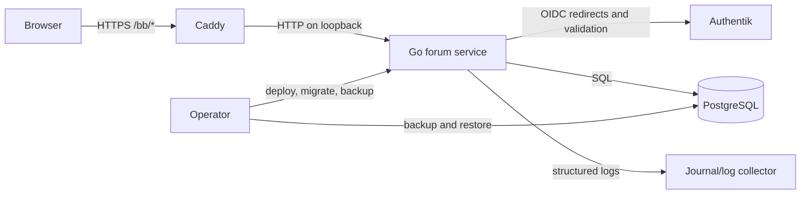

# Architecture

## Document control

| Field | Value |
| --- | --- |
| Status | Draft constrained by PRD 0.1 |
| Product | GOTTH Board |
| Applies to | Version 1.0 unless noted |
| Governing document | [Product requirements](prd.md) |

## 1. Decision summary

- Build a modular monolith in Go.
- Render HTML on the server with Templ.
- Use HTMX only for targeted page updates; every flow remains an ordinary HTTP
  request with server-side authorization and validation.
- Use Tailwind CSS for a compiled, static stylesheet.
- Use PostgreSQL as the only durable application store in version 1.0.
- Use Authentik OIDC as the only authentication authority.
- Store opaque, revocable sessions server-side.
- Model area visibility and posting mode as independent columns.
- Apply access predicates inside data-access queries and explicit write-policy
  checks.
- Deploy behind Caddy at the external `/bb/` prefix.
- Prefer direct SQL, explicit transactions, and small interfaces over an ORM or
  generic policy framework.

## 2. System context



Caddy owns public TLS and routing. The Go process binds to a non-public
interface. PostgreSQL is not exposed to the public network. Authentik is an
external trust boundary even when it runs on infrastructure controlled by the
same owner.

## 3. Architectural boundaries

### 3.1 Edge boundary

Caddy shall:

- Redirect `/bb` to `/bb/`.
- Match `/bb/*` and strip `/bb` before proxying to the application.
- Set normal reverse-proxy forwarding headers.
- Expose only intended application routes.
- Apply sensible request-body and timeout limits at the edge.

The application shall not derive its public origin or base path from incoming
forwarded headers. Both are trusted deployment configuration. This prevents a
client from manufacturing passwordless callback URLs, redirects, or links.

### 3.2 HTTP application boundary

The HTTP layer owns:

- Request parsing and size limits.
- Session loading.
- CSRF enforcement.
- Route-specific authorization calls.
- Validation error mapping.
- Full-page versus HTMX fragment selection.
- Response status, headers, redirects, and canonical links.

It does not own SQL or business transitions.

### 3.3 Application/service boundary

Small services coordinate use cases such as login callback, create topic, edit
post, change area access, and suspend member. Each mutation defines one
transaction boundary and one audit policy. Services accept typed inputs rather
than `http.Request`.

### 3.4 Policy boundary

Authorization is deliberately split:

1. Read repositories require an `AccessContext` and apply visibility in SQL.
2. Write services call explicit policy functions against the current actor and
   locked target rows.
3. HTTP middleware may reject obviously unauthenticated routes, but middleware
   is never the sole authorization control.

This avoids the classic failure where a topic page is protected but search,
counts, or an HTMX fragment leaks the same topic.

### 3.5 Repository boundary

Repositories contain SQL and row mapping. They do not return unrestricted
content for a caller to filter afterward. Repository interfaces are grouped by
use case rather than by one generic CRUD interface.

### 3.6 Rendering boundary

Templ components render typed view models. They do not query the database or
make authorization decisions. All URLs pass through one base-path-aware URL
builder. User Markdown is rendered and sanitized before it enters a Templ
component as explicitly typed trusted markup.

## 4. Request lifecycle

### 4.1 Read request

1. Caddy strips `/bb` and proxies the request on loopback.
2. Middleware assigns a request ID, recovers panics, sets defensive headers,
   and loads the opaque session cookie.
3. Session loading returns an anonymous or authenticated `AccessContext`.
4. The handler validates route parameters and calls a read repository.
5. The repository applies the area-access predicate in SQL.
6. A missing or unauthorized object returns the same not-found behavior.
7. The handler builds a typed view model.
8. Templ renders a full page or the documented HTMX fragment.

### 4.2 Mutation request

1. The common request lifecycle loads the actor.
2. CSRF validation runs before body processing with side effects.
3. The handler applies body limits, parses input, and returns field errors for
   invalid data.
4. The service starts a database transaction and locks the rows governing the
   transition.
5. The policy function evaluates the current actor and locked state.
6. The service performs the mutation and appends any required audit event.
7. The transaction commits once.
8. The response uses POST/Redirect/GET for full pages or a documented HTMX
   response for targeted interaction.

Retries are not automatic for mutations unless the operation has an explicit
idempotency key or the failure is known to occur before commit.

## 5. Public path handling

The initial development deployment uses `https://alhstudios.com/bb`.
Internally, after Caddy strips the prefix, routes begin at `/`. Production
deployments may use another origin or path without renaming the product.

The service receives two immutable settings:

- `PUBLIC_BASE_URL=https://alhstudios.com/bb`
- `BASE_PATH=/bb`

`PUBLIC_BASE_URL` constructs absolute OIDC and canonical URLs. `BASE_PATH`
constructs browser-facing relative URLs and the session-cookie Path. Incoming
forwarded headers may be logged for diagnosis but cannot override these values.

No template, redirect, form action, HTMX target, asset reference, or canonical
link may concatenate `/bb` itself. All use the URL builder. Tests run the same
view and handler suite with both `/bb` and an alternate prefix to expose hard-
coded paths.

## 6. Identity architecture

### 6.1 Login

1. The login endpoint creates cryptographically random state, nonce, and PKCE
   verifier values and stores their hashes or protected values in a short-lived
   login-attempt record.
2. The browser is redirected to the configured Authentik authorization
   endpoint.
3. Authentik redirects to the exact configured callback URL beneath `/bb`.
4. The callback consumes the state once, exchanges the code, validates issuer,
   audience, signature, expiry, nonce, and PKCE, then extracts approved claims.
5. One transaction creates a new verified identity as a local member or updates
   an existing approved profile snapshot, preserves every existing forum-local
   role/group assignment, and creates a new server-side session.
6. The old anonymous/login cookie state is rotated away.

### 6.2 Local account state

The forum stores display information for rendering and forum state for
operation. Authentik-sourced fields are distinguished from forum-owned fields.
A forum suspension never modifies Authentik. An Authentik disable does not
delete authored content.

### 6.3 Identity and local-authorization freshness

Version 1.0 does not store Authentik administrative credentials or user refresh
tokens. Approved profile claims are refreshed at successful authentication.
Forum roles and groups are local database state and are not derived from OIDC
claims. The maximum authenticated session lifetime and revalidation interval
are explicit settings.

When a protected request arrives after the revalidation interval, the existing
session does not authorize that request. The browser enters a short-lived OIDC
reauthorization flow. It may request noninteractive authorization where
Authentik's documented behavior permits it, but failure or required interaction
is shown honestly. Successful reauthorization refreshes identity/profile
state, creates a rotated session, and revokes the old session. Failure denies
the protected request; it never falls back to stale identity validation.

The configured interval therefore bounds stale Authentik disable state for
active protected use without storing long-lived Authentik tokens. Local role,
group, suspension, and mute state is loaded from PostgreSQL for protected
requests, so an audited local change takes effect without waiting for OIDC
reauthorization. The exact Authentik revalidation window is an owner decision
and no code may claim immediate disable propagation unless the deployed
integration actually provides and verifies it.

### 6.4 Logout

Local logout revokes the server-side session and expires the cookie. Optional
RP-initiated Authentik logout is a separate redirect after local revocation; a
failure at Authentik cannot resurrect the local session.

## 7. Authorization architecture

### 7.1 Access context

An `AccessContext` contains only the facts needed to authorize the current
request:

- Authentication status.
- Local user ID.
- Effective role.
- Current forum-local group IDs.
- Local suspension/mute state.
- Session validation timestamp.

### 7.2 Area visibility predicate

Conceptually, a row is visible when:

```text
role is moderator-or-admin
OR visibility is public
OR authenticated member AND visibility is authenticated
OR authenticated member AND visibility is groups
   AND member groups intersect area groups
```

The actual SQL shall use parameters and indexed relations. It shall not build
SQL from group names or role strings.

### 7.3 Posting predicate

Publishing additionally requires:

- An authenticated, non-suspended member.
- Visibility access.
- `posting_mode = normal`, unless the actor is moderator-or-admin.
- An unlocked topic for replies, unless the actor is moderator-or-admin.
- Applicable mute and rate-limit checks.

Archived areas reject publishing for every actor until an administrator
restores the area; moderators do not bypass archival state accidentally.

### 7.4 Elevated access

Moderator and administrator reads of restricted areas are required for global
moderation in version 1.0. The UI must identify elevated context where
practical. Mutations require reasons where the action changes visibility,
identity access, or content history.

## 8. Data architecture

### 8.1 Core relations

- `users`: local identity, profile snapshot, role, suspension state, timestamps.
- `external_identities`: OIDC issuer and subject, unique as a pair.
- `forum_groups`: locally administered groups and stable local identifiers.
- `forum_group_members`: audited local user-to-group membership.
- `sessions`: hashed opaque token, user, issued/expiry/validation timestamps,
  revocation state, and minimal client audit fields.
- `oidc_login_attempts`: short-lived, one-time state/nonce/PKCE records.
- `areas`: hierarchy-free version 1.0 category, visibility, posting mode, order.
- `area_groups`: local groups allowed to view a group-restricted area.
- `topics`: area, author, title, state, activity pointers, counters.
- `posts`: topic, author, stable number, Markdown source, sanitized rendering,
  revision, and soft-deletion state.
- `topic_reads`: per-user last-read position.
- `reports`: reporter, target, reason, state, assignment, resolution.
- `moderation_actions`: append-only audit record.
- `rate_limit_events` or equivalent bounded counters when in-process limiting
  is insufficient.

### 8.2 Identity constraints

Issuer and subject are immutable identity coordinates. Email and display name
are mutable attributes. External identity conflicts fail closed and require an
operator-visible error; they are never silently merged.

### 8.3 Content constraints

An area owns topics; a topic owns posts. A topic is created with post number 1
in one transaction. Reply numbering and activity pointers update while the
topic row is locked, preventing duplicate numbers and lost counters.

Posts keep Markdown source as canonical content. Sanitized HTML may be stored
as a derived cache with a renderer-version marker. A renderer change can rebuild
the cache from source.

### 8.4 Soft deletion and audit

Soft-deleted content retains identity and moderation context but is hidden from
ordinary readers. Audit events capture state transitions rather than mutable
prose logs. Hard purge follows a separate retention procedure and must not
silently break referential or audit integrity.

## 9. Transactions and concurrency

- Login callback: identity upsert, groups, role, and session in one transaction.
- Topic creation: topic, first post, and area/topic counters in one transaction.
- Reply creation: lock topic, verify state, allocate number, insert post, update
  activity in one transaction.
- Post edit: use a revision number to detect stale concurrent edits.
- Area access change: update policy and append audit event in one transaction.
- Moderation mutation: lock target, transition state, append audit event in one
  transaction.

Database constraints remain authoritative. Application checks improve errors
but do not replace uniqueness, foreign keys, check constraints, and transaction
isolation.

## 10. Search and unread state

PostgreSQL full-text search is sufficient for version 1.0. Search vectors are
derived from topic titles and visible post content. The access predicate joins
areas before ranking or returning results. Restricted text must not enter a
shared unauthenticated cache.

Unread state records the last post position read for a user and topic. Counts
may be approximate only if the UI labels them as such; access filtering is never
approximate.

## 11. Rendering and client behavior

Templ renders semantic HTML. HTMX swaps documented fragments and sends the same
session and CSRF protections as normal forms. JavaScript is not an
authorization boundary.

Tailwind output is compiled at build time. No Tailwind runtime or arbitrary
class construction from user input is permitted. Static assets are content-
hashed or release-versioned and referenced through the URL builder.

## 12. Security architecture

- Default-deny route and policy design.
- OIDC discovery and key validation only from the configured issuer.
- Exact redirect URI allowlisting.
- One-time login state and nonce records with short expiry.
- Opaque session tokens; only hashes are stored.
- CSRF protection on every state-changing browser request.
- Strict content sanitization and a restrictive CSP.
- Body-size, field-size, and pagination limits.
- Parameterized SQL only.
- Secrets supplied at runtime and excluded from logs.
- Restricted content omitted before rendering, counting, search ranking, and
  cache population.
- Security-relevant transitions recorded with request and actor correlation.

## 13. Runtime topology

Version 1.0 runs as:

- One Caddy instance serving the domain and proxying `/bb/*`.
- One or more identical Go service processes; alpha may use one.
- One PostgreSQL database.
- A migration command using the same release artifact as the service.
- A process supervisor or container runtime with explicit restart policy.

The application binary is immutable for a release. Configuration and secrets
are external. Database migrations run once before the new service becomes
ready.

## 14. Failure behavior

- Authentik unavailable during new login: deny new login with a diagnostic
  request ID; do not create partial users.
- OIDC verification failure: deny, consume unsafe transient state as
  appropriate, and log without tokens.
- PostgreSQL unavailable: readiness fails and requests return a bounded error;
  do not claim success.
- Commit outcome unknown: do not blindly retry a mutation.
- Rendering failure: return an error page/fragment with request ID; never emit a
  success status around partial content.
- Audit insertion failure: roll back the audited mutation.
- Access-state load failure: deny access.

## 15. Evolution

Version 2 adds background delivery, object storage, and richer content without
splitting the monolith. Version 3 adds communication and trust state. Version 4
adds SCIM, APIs, and stronger governance boundaries. Version 5 may justify
separate workers, external search, federation services, or read replicas.

Those later boundaries are introduced only when their mechanics exist. Version
1.0 shall not build fake service abstractions for imaginary distributed
components.

## 16. Rejected alternatives

- **Local authentication:** duplicates Authentik and creates unnecessary secret
  handling.
- **ORM-first persistence:** obscures access predicates and transaction costs.
- **Per-topic ACLs in 1.0:** expands the authorization matrix without a current
  product need.
- **WebSockets in 1.0:** adds connection state without a real-time requirement.
- **External search in 1.0:** duplicates PostgreSQL state and complicates access
  deletion and reconciliation.
- **Microservices:** provide failure modes and network boundaries without scale
  or ownership that justifies them.
- **Trusting forwarded host/prefix values:** allows request-controlled URL and
  callback behavior.
