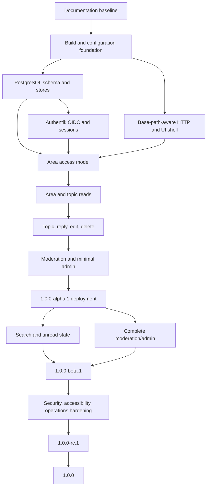

# Feature decomposition and delivery plan

## Document control

| Field | Value |
| --- | --- |
| Status | Draft constrained by PRD, architecture, and implementation spec |
| Current target | `1.0.0-alpha.1` |
| Product scope | [Product requirements](prd.md) |
| Technical scope | [Implementation specification](implementation-spec.md) |

## 1. Delivery rules

1. Work proceeds in document order: PRD, architecture, implementation spec,
   feature decomposition, implementation, verification, release evidence.
2. Each feature issue names the requirement IDs it satisfies.
3. Each feature is implemented in an isolated worktree.
4. One background worker owns one feature worktree until the assigned issue is
   `DONE`, `BLOCKED`, or `FAILED`.
5. A worker fixes one issue at a time and aims for complete relevant test
   coverage of the changed surface. Any gap is explicit evidence, not silence.
6. Workers do not create pull requests unless specifically authorized.
7. A `HANDOFF` receives orchestrator review before PR creation or a new issue in
   the same worktree.
8. Generated worker locks, notes, and evidence remain ignored scratch unless a
   deliberate review promotes useful evidence into canonical documents.
9. No feature is called complete while permission, failure, migration, or
   rollback behavior remains undefined.
10. Deployment and migration mutations require a release checklist and an
    identified rollback path.

## 2. Dependency map

## 3. Milestone `1.0.0-alpha.1`

Alpha.1 proves the complete mechanism beneath the real `/bb` prefix. It is not
feature-complete version 1.0.

### A1-00: documentation baseline

Requirements: all planning prerequisites.

Deliverables:

- Owner-reviewed PRD and unresolved-decision list.
- Reviewed architecture and implementation specification.
- Feature, verification, and release-operation plans.
- Requirement IDs stable enough for issue decomposition.

Exit evidence:

- Document links resolve.
- No downstream document silently contradicts the PRD.
- Open owner decisions are assigned before dependent implementation.

### A1-01: build and repository foundation

Requirements: UX-004, SEC-005, OPS-001 through OPS-005.

Deliverables:

- Pinned Go toolchain and dependency policy.
- Reproducible Templ, Tailwind, and static-asset build.
- Configuration parser and validation.
- Structured logging, request IDs, panic boundary, liveness, readiness.
- Local development and test commands.
- CI checks for format, generation drift, unit tests, and secret scanning.

Exit evidence:

- Clean checkout builds without undocumented global tools.
- Invalid production configuration fails startup with a useful non-secret
  message.
- Generated files are reproducible.

### A1-02: PostgreSQL foundation

Requirements: OPS-001 and database portions of FORUM-001 through FORUM-006.

Deliverables:

- Connection-pool lifecycle.
- Initial migrations for identity, sessions, areas, topics, posts, and audit.
- sqlc generation and transaction wrapper.
- Fresh-database migration test.

Exit evidence:

- Constraints reject invalid roles, visibility, posting modes, duplicate
  identities, and duplicate post numbers.
- Failed transactions leave no partial rows.

### A1-03: base-path-aware HTTP shell

Requirements: READ-005, UX-001 through UX-005, SEC-002, SEC-003.

Deliverables:

- Router, middleware ordering, URL builder, layout, navigation, error pages.
- Full-page and HTMX response conventions.
- Tailwind responsive shell and keyboard focus treatment.
- Session-cookie path and canonical URL support for `/bb`.

Exit evidence:

- Core rendered pages contain no application links that escape `/bb`.
- Full-page and HTMX error paths use correct non-success statuses.

### A1-04: Authentik OIDC and session core

Requirements: ID-001 through ID-009.

Deliverables:

- OIDC discovery and provider validation.
- State, nonce, PKCE, callback, and one-time login-attempt storage.
- Just-in-time local account and group upsert.
- Role mapping and membership policy.
- Opaque server-side session, rotation, expiration, revocation, logout.

Exit evidence:

- Controlled issuer tests cover success, state mismatch, nonce mismatch,
  invalid signature, wrong issuer/audience, expired attempt, replay, and
  ineligible group.
- Logs and browser state contain no token leaks.

### A1-05: area access model

Requirements: ACL-001 through ACL-008, ADMIN-001, ADMIN-003.

Deliverables:

- Area and group-restriction schema/repositories.
- Explicit read predicate and write policies.
- Minimal administrator area creation/edit interface.
- Immutable audit event for access-rule changes.

Exit evidence:

- Automated access matrix covers visitor, member, matching/nonmatching group,
  moderator, and administrator against every visibility/posting combination.
- Unauthorized direct reads match missing-object behavior.

### A1-06: forum read path

Requirements: FORUM-001 through FORUM-006, READ-001, READ-005.

Deliverables:

- Area index, area topic list, and paginated topic page.
- Stable topic and post URLs.
- Pinned, locked, hidden, and archived display state.
- Access-controlled list counts.

Exit evidence:

- Restricted content is absent from every alpha list, count, and breadcrumb.
- Pagination limits and invalid cursors/pages are bounded.

### A1-07: forum write path

Requirements: CONTENT-001 through CONTENT-007 and publishing portions of
FORUM-003 through FORUM-005.

Deliverables:

- Markdown renderer/sanitizer and preview.
- Create topic and reply.
- Edit with revision conflict detection.
- Author soft delete.
- Topic locking enforcement and posting-mode enforcement.

Exit evidence:

- Concurrent replies receive unique ordered post numbers.
- XSS and unsafe-link corpus is rejected or neutralized.
- Validation preserves submitted source without publishing it.

### A1-08: minimal moderation

Requirements: MOD-003, MOD-004, MOD-007, MOD-008 and ADMIN-002.

Deliverables:

- Minimal moderator actions: lock/unlock, hide/restore, suspend/reinstate.
- Local account status view.
- Required reason and append-only audit event.

Exit evidence:

- Audit failure rolls back the moderated mutation.
- Suspended users lose publishing access without losing authored content.

### A1-09: alpha deployment

Requirements: OPS-002 through OPS-005 and alpha acceptance boundary.

Deliverables:

- Immutable release artifact tagged `1.0.0-alpha.1`.
- Caddy `/bb` route, runtime service, PostgreSQL, and Authentik client configured
  in the alpha environment.
- Migration, smoke-test, and rollback commands.
- Deployment record containing release commit and migration state.

Exit evidence:

- Every PRD alpha.1 acceptance item passes against the deployed environment.
- Rollback to the previous application artifact is rehearsed when a previous
  artifact exists; database rollback limitations are explicit.

## 4. Milestone `1.0.0-alpha.N`

Additional alpha releases integrate the remaining version 1.0 behavior while
the user surface may still change.

### AN-01: reports and moderation queue

Requirements: MOD-001 through MOD-004, MOD-007, MOD-008.

- Report creation with duplicate/abuse limits.
- Queue, assignment, resolution, moderator notes, and complete transitions.
- Hide, restore, redact, pin, unpin, move, warn, mute, suspend, reinstate.

### AN-02: search and recent activity

Requirements: READ-003, READ-004, SEC-004.

- PostgreSQL text vectors and ranking.
- Text, author, area, and date filters.
- Access-filtered recent activity and search counts/snippets.

### AN-03: unread state

Requirements: READ-002, READ-004.

- Monotonic per-topic read markers.
- New/unread indicators and first-unread navigation.
- Access and deletion behavior defined.

### AN-04: administration completion

Requirements: ADMIN-001 through ADMIN-005.

- Area ordering, archive/restore, group rules, account state, site settings,
  community rules, and basic authorized counts.

### AN-05: basic abuse controls

Requirements: MOD-005, MOD-006.

- Request and publication rate limits.
- New-account policy.
- Blocked-link/domain rules.
- Observable and bounded rejection behavior.

## 5. Milestone `1.0.0-beta.1`

Beta.1 is feature-complete for the version 1.0 PRD. Ordinary test users should
not encounter knowingly absent core features.

Entry gates:

- All version 1.0 functional requirements implemented.
- Complete access-leakage suite passes.
- Upgrade from a previous alpha database passes.
- Known limitations are documented and do not include critical security or
  data-loss defects.

Beta work emphasizes:

- Real user feedback and usability corrections.
- Accessibility audit of all core flows.
- Query plans and pagination under representative data.
- Authentik group-change and session-revocation behavior.
- Backup/restore implementation and initial rehearsal.
- Operator dashboards, logs, and actionable error behavior.

## 6. Milestone `1.0.0-rc.1`

Release candidate means no known product-scope gap.

Entry gates:

- Every version 1.0 requirement has evidence.
- No open critical/high defect.
- Migration sequence is frozen except for release-blocking correction.
- Dependency and license review complete.
- Threat-model and permission review complete.

RC work is limited to defect correction, operational rehearsal, documentation,
and evidence completion. New features return to a later release.

## 7. Milestone `1.0.0`

Stable release requires:

- Fresh install, upgrade, backup, restore, deploy, and rollback rehearsal.
- Final accessibility and security gates.
- Operator sign-off on monitoring and incident procedures.
- Owner acceptance of the deployed candidate.
- Exact known-good commit and artifact recorded after owner confirmation.

## 8. Versions 2.0 through 5.0

The PRD owns the product scope. Before implementation of each major version:

1. Split its feature inventory into a version-specific PRD amendment.
2. Revise architecture only where the new mechanics require it.
3. Write implementation contracts and migration/rollback behavior.
4. Decompose into independently reviewable feature issues.
5. Preserve backward-compatible userspace unless the major-version PRD
   explicitly approves a break and migration path.

Do not prebuild version 4 or 5 abstractions in version 1.0.

## 9. Issue contract

Every implementation issue contains:

- Problem and user-visible outcome.
- Requirement IDs.
- In-scope and out-of-scope behavior.
- Trust boundary and permission effect.
- Data/migration effect.
- Failure and retry behavior.
- Acceptance tests.
- Rollback or recovery path.
- Evidence location.
- Dependency and worktree assignment.

Issue states are `READY`, `ACTIVE`, `HANDOFF`, `DONE`, `BLOCKED`, or `FAILED`.
Only one issue is `ACTIVE` per feature worktree.

## 10. Change control

If implementation reveals that a requirement is impossible, unsafe, or much
more expensive than represented, stop and update the appropriate upstream
document. Do not hide product changes inside an implementation PR.
