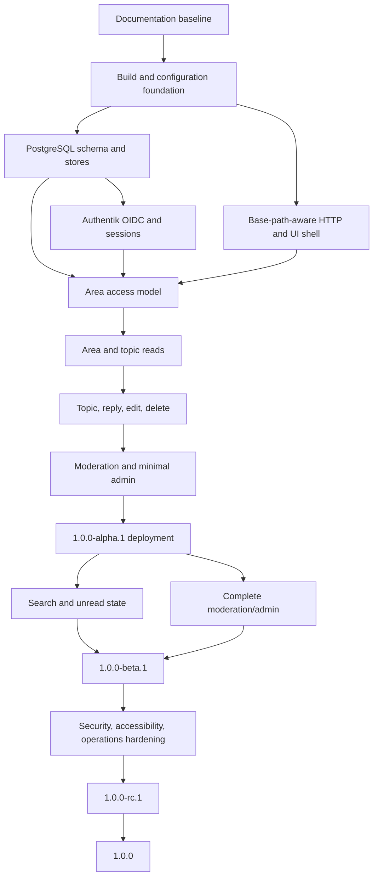

# Feature decomposition and delivery plan

## Document control

| Field | Value |
| --- | --- |
| Status | Draft constrained by PRD, architecture, and implementation spec |
| Current target | `1.0.0-beta.1` — Beta.1 admission |
| Product scope | [Product requirements](prd.md) |
| Technical scope | [Implementation specification](implementation-spec.md) |

## 1. Delivery rules

1. Work proceeds in document order: PRD, architecture, implementation spec,
   feature decomposition, implementation, verification, release evidence.
2. Each feature issue names the requirement IDs it satisfies.
3. Each feature is implemented in an isolated worktree.
4. One background worker owns one feature worktree until the assigned issue is
   `DONE`, `BLOCKED`, or `FAILED`.
5. A worker fixes one issue at a time and aims for complete relevant test
   coverage of the changed surface. Any gap is explicit evidence, not silence.
6. Workers do not create pull requests unless specifically authorized.
7. A `HANDOFF` receives orchestrator review before PR creation or a new issue in
   the same worktree.
8. Generated worker locks, notes, and evidence remain ignored scratch unless a
   deliberate review promotes useful evidence into canonical documents.
9. No feature is called complete while permission, failure, migration, or
   rollback behavior remains undefined.
10. Deployment and migration mutations require a release checklist and an
    identified rollback path.

## 2. Dependency map

## 3. Milestone `1.0.0-alpha.1`

Alpha.1 proves the complete mechanism at the real `bb.alhstudios.com` origin.
It is not feature-complete version 1.0.

### A1-00: documentation baseline

Requirements: all planning prerequisites.

Deliverables:

- Owner-reviewed PRD and unresolved-decision list.
- Reviewed architecture and implementation specification.
- Feature, verification, and release-operation plans.
- Requirement IDs stable enough for issue decomposition.

Exit evidence:

- Document links resolve.
- No downstream document silently contradicts the PRD.
- Open owner decisions are assigned before dependent implementation.

### A1-01: build and repository foundation

Requirements: UX-004, SEC-005, OPS-001 through OPS-005.

Deliverables:

- Pinned Go toolchain and dependency policy.
- Reproducible Templ, Tailwind, and static-asset build.
- Configuration parser and validation.
- Structured logging, request IDs, panic boundary, liveness, readiness.
- Local development and test commands.
- CI checks for format, generation drift, unit tests, and secret scanning.

Exit evidence:

- Clean checkout builds without undocumented global tools.
- Invalid production configuration fails startup with a useful non-secret
  message.
- Generated files are reproducible.

### A1-02: PostgreSQL foundation

Requirements: OPS-001 and database portions of FORUM-001 through FORUM-006.

Deliverables:

- Connection-pool lifecycle.
- Initial migrations for identity, sessions, areas, topics, posts, and audit.
- sqlc generation and transaction wrapper.
- Fresh-database migration test.

Exit evidence:

- Constraints reject invalid roles, visibility, posting modes, duplicate
  identities, and duplicate post numbers.
- Failed transactions leave no partial rows.

### A1-03: base-path-aware HTTP shell

Requirements: READ-005, UX-001 through UX-005, SEC-002, SEC-003.

Deliverables:

- Router, middleware ordering, URL builder, layout, navigation, error pages.
- Full-page and HTMX response conventions.
- Tailwind responsive shell and keyboard focus treatment.
- Session-cookie path and canonical URL support for `/bb`.

Exit evidence:

- Core rendered pages contain no application links that escape `/bb`.
- Full-page and HTMX error paths use correct non-success statuses.

### A1-04: Authentik OIDC and session core

Requirements: ID-001 through ID-013.

Deliverables:

- OIDC discovery and provider validation.
- State, nonce, PKCE, callback, and one-time login-attempt storage.
- Just-in-time local account/profile upsert without OIDC authorization claims.
- Exact-subject, reauthenticated, CSRF-protected first-run administrator claim
  with atomic session revocation and the operator command retained as fallback.
- Dedicated Authentik email-verified enrollment flow and board-only access
  group, gated on explicit sibling-application bindings.
- Opaque server-side session, rotation, expiration, revocation, logout.

Exit evidence:

- Controlled issuer tests cover success, state mismatch, nonce mismatch,
  invalid signature, wrong issuer/audience, expired attempt, replay, and
  attempted privilege injection through unapproved claims.
- Concurrent browser/operator bootstrap evidence proves exactly one immutable
  audit, one administrator, and permanent closure after success.
- Enrollment evidence proves a new Authentik user joins only the board access
  group and receives only the local member role on first login.
- Logs and browser state contain no token leaks.

### A1-05: area access model

Requirements: ACL-001 through ACL-008, ADMIN-001, ADMIN-003.

Deliverables:

- Area and group-restriction schema/repositories.
- Explicit read predicate and write policies.
- Minimal administrator area creation/edit interface.
- Immutable audit event for access-rule changes.

Exit evidence:

- Automated access matrix covers visitor, member, matching/nonmatching group,
  moderator, and administrator against every visibility/posting combination.
- Unauthorized direct reads match missing-object behavior.

### A1-06: forum read path

Requirements: FORUM-001, FORUM-002, FORUM-005, FORUM-006, the alpha.1
flat-topic baseline of READ-001, and READ-005.

Deliverables:

- Area index, area topic list, and paginated topic page.
- Canonical positive topic-ID parsing and bounded 25-post pages.
- One atomically access-filtered topic metadata and post-page query.
- Stable topic and post URLs.
- Pinned, locked, hidden, and archived display state.
- Access-controlled list counts.

Exit evidence:

- Restricted content is absent from every alpha list, count, and breadcrumb.
- Pagination limits and invalid IDs/cursors/pages are bounded.

### A1-07: forum write path

Requirements: CONTENT-001 through CONTENT-007, the alpha.1 flat-reply baseline
of FORUM-003, and FORUM-005. Threaded completion of FORUM-003 and FORUM-004 is
owned by A2-04 and A2-05.

Deliverables:

- Markdown renderer/sanitizer and preview.
- Create topic and reply.
- Edit with revision conflict detection.
- Author soft delete.
- Topic locking enforcement and posting-mode enforcement.

Exit evidence:

- Concurrent replies receive unique ordered post numbers.
- XSS and unsafe-link corpus is rejected or neutralized.
- Validation preserves submitted source without publishing it.

### A1-08: minimal moderation

Requirements: MOD-003, MOD-004, MOD-007, MOD-008 and ADMIN-002.

Deliverables:

- Minimal moderator actions: lock/unlock, hide/restore, suspend/reinstate.
- Local account status view.
- Required reason and append-only audit event.

Exit evidence:

- Audit failure rolls back the moderated mutation.
- Suspended users lose publishing access without losing authored content.

### A1-09: alpha deployment

Requirements: OPS-002 through OPS-005 and alpha acceptance boundary.

Deliverables:

- Immutable release artifact tagged `1.0.0-alpha.1`.
- Caddy `bb.alhstudios.com` site, a two-service Docker Compose project for the
  application and PostgreSQL, and the Authentik client/enrollment flow
  configured in the alpha environment.
- Migration, smoke-test, and rollback commands.
- Deployment record containing release commit and migration state.

Exit evidence:

- Every PRD alpha.1 acceptance item passes against the deployed environment.
- Rollback to the previous application artifact is rehearsed when a previous
  artifact exists; database rollback limitations are explicit.
- Container inspection proves nonroot execution, read-only application root,
  dropped capabilities, no privilege escalation, loopback-only publication,
  external secrets, pinned images, and preserved PostgreSQL storage.

## 4. Milestone `1.0.0-alpha.2`

Alpha.2 establishes the conventional, information-dense GOTTH Board forum
surface and parent-addressed threaded conversations. It does not absorb
reports, search, unread state, new moderation transitions, administration
completion, abuse controls, or registration-policy changes.

### A2-00: presentation contract

Requirements: UX-001 through UX-005, READ-001, READ-005, ACL-004 through
ACL-006, and the PRD alpha.2 acceptance boundary.

- Record the actor-filtered aggregate read model, semantic HTML contract,
  responsive collapse, HTMX invariants, and third-party asset boundary.
- Decompose the work so read-model changes land before dependent templates.

### A2-01: authorized board-index summaries

Requirements: READ-001, ACL-004 through ACL-006, ADMIN-005.

- Add one access-filtered SQL/store projection for exact topic/post counts and
  latest visible post metadata.
- Reject malformed or partially nullable projections before rendering.
- Prove public, authenticated, group, staff, hidden-topic, soft-delete, empty,
  and failure behavior without per-area queries.

### A2-02: masthead and board index

Requirements: UX-001 through UX-004, READ-001, READ-005.

- Add compact GOTTH Board masthead, utility navigation, breadcrumb bar, forum
  rows, desktop statistics, mobile metadata, empty state, and focus behavior.
- Preserve content-addressed assets, canonical URLs, full-page/HTMX parity,
  and ordinary navigation fallback.

### A2-03: topic-list surface

Requirements: UX-001 through UX-004, READ-001, READ-005.

- Present topic state, title/starter, replies, and last activity as compact
  forum rows using the existing authorized topic-page projection.
- Keep pagination, publishing eligibility, moderation state, and canonical
  navigation behavior unchanged.

### A2-04: threaded-reply data and publication

Requirements: FORUM-003, FORUM-004, FORUM-006, CONTENT-005, CONTENT-006,
READ-006, ACL-004 through ACL-006.

- Add the additive parent/path migration, alpha.1 compatibility behavior,
  immutable same-topic tree constraints, bounded depth, and tree-order index.
- Backfill existing replies beneath each topic root and prove migration,
  integrity, rollback compatibility, and hard-purge refusal behavior.
- Require and reauthorize an explicit visible parent during reply preview and
  publication while preserving topic counters, chronology, and HTMX fallback.

### A2-05: threaded topic and post surface

Requirements: UX-001 through UX-005, FORUM-004, CONTENT-004 through
CONTENT-006, READ-001, READ-005, READ-006.

- Render semantic post articles with desktop author/content columns and a
  bounded-depth reply hierarchy, visible reply-to context, connector styling,
  tombstones, and capped mobile indentation.
- Unify action buttons, publishing forms, notices, pagination, and moderation
  controls while preserving HTMX swaps and conflict drafts.
- Prove tree-order pages, stable post links, omitted-parent context, keyboard
  order, 320-pixel layout, and no per-post query behavior.

### A2-06: integrated acceptance and deployment

- Run migration, tree-integrity, access-leakage, SQL/store, publishing,
  HTTP/HTMX, responsive, keyboard, generation, race, PostgreSQL integration,
  deterministic artifact, backup, deploy, and rollback evidence.
- Require owner acceptance before recording the alpha.2 known-good reference.

## 5. Milestone `1.0.0-alpha.N`

Additional alpha releases integrate the remaining version 1.0 behavior while
the user surface may still change.

### A3-01: GitHub Flavored Markdown and native toolbar

Requirements: CONTENT-001 through CONTENT-003, CONTENT-006, SEC-004, OPS-001.

- Pin the Goldmark v1.8.5 GFM and Bluemonday v1.0.27 contracts; keep raw HTML,
  unsafe URLs, styles, event handlers, and arbitrary form controls forbidden.
- Extend the one renderer/sanitizer boundary with tables, strikethrough, task
  lists, and GFM autolinks; preserve Markdown as authoritative source.
- Add a full-SHA-256-content-addressed progressive-enhancement toolbar with the
  eleven required shortcuts and accessible native controls. Do not expose an
  Image shortcut while version 1 forbids attachments and arbitrary embeds;
  defer image authoring to version 2 plus `gotth-media` so the media security,
  privacy, quota, retention, and failure contracts exist first.
- Add the renderer-state migration plus bounded restart-safe re-render command,
  a durable nullable post-ID keyset cursor advanced atomically with each batch,
  exact p1-overflow compatibility marker, edit serialization, completion
  oracle, exact readiness gate, and rollback record. Keep the 262,144-byte persisted
  output limit; preserve only byte-verified p1 HTML when p2 expansion exceeds
  it, and fail closed on every other render or legacy-integrity error.
- Make the ordinary argument-free migration command run a population-linear
  read-only candidate preflight in bounded transactions after stop/drain and
  before migration 000007;
  a failed classification must leave its ledger/state/constraint absent.
- Prove every create/reply/edit/preview/publish/read path uses the same policy;
  cover normative GFM, XSS, malformed and size boundaries, toolbar selection,
  caret, multiline, toggle, keyboard/semantic, JavaScript-failure, HTMX, fresh
  and populated upgrade, exact p1 preservation, forged-marker refusal at the
  runtime API boundary, restart, idempotence, concurrency, and rollback cases.
- Prove the mutation pass examines the 25,000-row evidence population once in
  primary-key order, performs exactly 250 nonempty selections plus one final
  empty selection, and never revisits an identity at or below its prior cursor.
- Run performance admission and two independent fresh cold Judge passes before
  alpha.3 may be admitted. No deployment or release is part of this feature.

### AN-01: reports and moderation queue

Requirements: MOD-001 through MOD-004, MOD-007, MOD-008.

- Authenticated active members may report one visible topic, undeleted visible
  post, or non-self visible post author with a canonical 1-2,000 byte reason.
  One reporter may hold at most 25 active reports and only one active report
  for the same target.
- The staff queue returns at most 25 active reports per page, ordered open
  before in-review and then oldest first. Staff self-claim an open report;
  moderators may finish only their own claims while administrators may finish
  any claim. Notes are append-only. Resolve and dismiss are irreversible
  terminal transitions in this release and require a resolution reason.
- Topic pin/unpin and move, post hide/restore and irreversible redaction, and
  user warn/mute complete the already implemented lock/unlock, topic
  hide/restore, and suspend/reinstate surface. Every successful mutation and
  report-processing step appends exactly one immutable audit row atomically.

### AN-02: search and recent activity

Requirements: READ-003, READ-004, SEC-004.

AN-02 depends on admitted Alpha.3 commit
`af194df197c9e2f9ceec3b26b3891cad7ad00cf1`. Its serial implementation units
are:

1. **AN-02-01 — projection and restart-safe migration.** Add the exact
   `search-v1-pg17-simple-u15-p2` renderer-owned vector contract, migration
   000008 schema/checks/indexes/narrowed triggers, stopped full preflight,
   topic/post batch backfill, completion oracle, readiness checks, writer
   integration, and fresh/upgrade/restart/concurrent-runner evidence. Do not
   add routes before the projection gate is complete.
2. **AN-02-02 — authorization-first stores and cursor.** Add bounded request
   types, PostgreSQL web-search parsing, the typed 51-identity candidate/page
   query, 26-row activity keyset, primary-key direct-post query, strict
   cursor/audience/keyring codec, and visitor/member/group/staff matrices.
   Plans must prove authorization before limits/rank/excerpts/terminality on the
   representative PostgreSQL corpus.
3. **AN-02-03 — HTTP and progressive UI.** Add exact optional-session routes,
   navigation/search form, full/HTMX parity, base-path canonical links, fixed
   statuses, two-permit/deadline/buffer behavior, safe excerpt rendering,
   application-log redaction, and browser-through-Caddy accessibility/slow-
   client evidence.
4. **AN-02-04 — integrated admission.** Reproduce generated SQL/static/Templ
   state; run focused unit, PostgreSQL 17 integration/race, migration,
   100,000-topic/1,000,000-post plan/resource, browser, repository-integrity,
   and exact-artifact gates; retain evidence; then obtain two fresh clean
   reviews on one exact final tree.

The units stay in one isolated feature worktree and move one at a time through
DONE/HANDOFF/orchestrator review. Corpus sizes are evidence points, never
publication quotas. Workers do not create PRs, merge, push, release, or deploy
without later explicit authorization.

### AN-03: unread state

Requirements: READ-002, READ-005, ACL-004 through ACL-006, SEC-001, SEC-005.

AN-03 depends on admitted AN-02 commit
`dc96d51386e0b81b0f826a4889d7594ca5dbbac9`. Its serial implementation units
are:

1. **AN-03-01 — schema and authorization-first read models.** Add migration
   000009's finite read-time check and partial visible-post index; extend the
   authenticated board summary with exact unread-topic counts and the bounded
   area page with closed `new`/`unread`/`read` state; preserve the visitor
   shape; and retain visitor/member/group/staff PostgreSQL 17 plan evidence.
2. **AN-03-02 — monotonic mark-read writes.** Add the strict mark-read
   transaction/service, `GREATEST` concurrency behavior, and private-row
   validation. Exclude the actor's own posts from unread eligibility and prove
   that every topic/reply publication path writes zero markers. Prove retries,
   stale forms, concurrent devices, post races, access revocation,
   deletion/redaction/restoration, session invalidation, and unknown mark-read
   outcomes.
3. **AN-03-03 — first-unread route and progressive UI.** Add the exact
   read-only first-unread route, strict CSRF-protected mark-read route,
   builder-owned redirects, topic/list/index controls, full-page/HTMX parity,
   base-path handling, private caching, fixed failures, and browser-through-
   Caddy keyboard/accessibility evidence.
4. **AN-03-04 — integrated admission.** Reproduce generated state; run focused
   unit, PostgreSQL 17 integration/race, migration, representative population/
   plan/resource, authorization-leakage, browser, repository-integrity, and
   exact-artifact gates; retain evidence; then obtain two fresh clean reviews
   on one exact final tree.

The units stay in one isolated feature worktree and move one at a time through
DONE/HANDOFF/orchestrator review. No unit adds automatic GET mutation, a global
unread feed, notification delivery, anonymous tracking, or a new service.
Workers do not create PRs, merge, push, release, or deploy without later
explicit authorization.

### AN-04: administration completion

Requirements: ADMIN-001 through ADMIN-005.

AN-04 depends on admitted AN-03 commit
`f845105ca3ad9283b498eb4efa5baf08c328281f`. Its serial implementation units
are:

1. **AN-04-01 — schema, site presentation, and settings.** Add migration
   000010's singleton site settings, positive administration revisions, closed
   brand theme, current rendered-rules tuple, audit target/actions, and exact
   catalog/readiness checks. Add separate shell/rules/edit projections, the
   public rules page, and audited administrator settings transaction. Preserve
   static/health/fragment independence and use no process-local settings cache.
2. **AN-04-02 — account, role, and group governance.** Add bounded
   administrator account list/detail reads, create/rename group transactions,
   paged single group-membership grants/revocations, and role changes. Serialize role
   changes with the governance singleton, reject self-role changes, preserve one
   active administrator, revoke the target's sessions when its role changes,
   and retain the existing audited suspension service.
3. **AN-04-03 — administration routes, counts, and progressive UI.** Add the
   administrator dashboard and exact membership/activity/moderation counts;
   bounded account, group, area-mapping, and settings pages; strict CSRF-protected mutation
   routes; a single administration navigation entry; full-page/HTMX parity;
   base-path handling; private no-store responses; and browser-through-Caddy
   keyboard/accessibility evidence. Retain the existing area service while
   proving explicit rename/reorder/archive/restore/group-restriction behavior.
4. **AN-04-04 — integrated admission.** Reproduce generated state; run focused
   unit, PostgreSQL 17 integration/race, migration, representative population/
   plan/resource, authorization-leakage, browser, repository-integrity, and
   exact-artifact gates; retain evidence; then obtain two fresh clean reviews
   on one exact final tree.

The units stay in one isolated feature worktree and move one at a time through
DONE/HANDOFF/orchestrator review. AN-04 adds no Authentik administration,
password management, group deletion, arbitrary CSS or remote branding asset,
impersonation, bulk mutation, analytics warehouse, external service, or
background worker. Workers do not create PRs, merge, push, release, or deploy
without explicit authorization.

### AN-05: basic abuse controls

Requirements: MOD-005, MOD-006.

AN-05 depends on admitted AN-04 commit
`d92407a6efbd1ea0e3ad98dc22283c4d0a225170`. Its serial implementation units
are:

1. **AN-05-01 — startup policy and bounded request admission.** Add strict
   rate/rules configuration; descriptor-safe bounded rules-file loading; the
   canonical Caddy client-address overwrite contract; and the fixed-capacity,
   keyed, process-local request window before authentication/body/database
   work. Prove health/static exemptions, spoof rejection, body non-consumption,
   capacity/restart behavior, fixed `429`/`503`, and secret/input-free logs.
2. **AN-05-02 — transactional publication limits.** Add migration 000011's
   constant-size account window tuple, check/grant/readiness attestation, and
   authorization-first account lock. Make successful topic/reply creation and
   its counter one timeout-bounded atomic transaction; prove established/new-account windows,
   every role, concurrency, rollback, cancellation, restart persistence, and
   unknown commit. Edits and previews spend no publication capacity.
3. **AN-05-03 — blocked destinations and progressive rejection UI.** Parse the
   admitted GFM document once; apply canonical bounded domain/exact-URL rules
   to resolved links, images, and automatic links; and wire identical policy
   through topic/reply/edit previews and mutations plus the administrator
   community-rules writer without charging edit/preview/settings publication
   capacity. Add fixed field-safe `422` and draft-preserving `429` full-page/
   HTMX behavior, no-JavaScript/browser-
   through-Caddy evidence, and fixed-class observability without addresses,
   accounts, content, URLs, or rules.
4. **AN-05-04 — integrated admission and AN delivery.** Reproduce generated
   state; run focused unit, PostgreSQL 17 integration/race, migration, proxy,
   authorization, concurrency, population/resource, browser, log-redaction,
   repository-integrity, and exact-artifact gates; retain evidence; obtain two
   fresh CLEAN reviews on one exact final tree; then deliver AN-05 through the
   approved PR/fast-forward/mirror workflow.

The units remain in one isolated feature worktree and move serially through
DONE/HANDOFF/review. AN-05 adds no event ledger, cleanup worker, CAPTCHA,
external reputation or DNS service, redirect fetching, automatic moderation,
distributed limiter, horizontal-replica claim, tag, release, or deployment.

## 6. Milestone `1.0.0-beta.1`

Beta.1 is feature-complete for the version 1.0 PRD. Ordinary test users should
not encounter knowingly absent core features.

Entry gates:

- All version 1.0 functional requirements implemented.
- Complete access-leakage suite passes.
- Upgrade from a previous alpha database passes.
- Known limitations are documented and do not include critical security or
  data-loss defects.

Beta.1 is delivered through the following serial units in one isolated
`feature/beta-1-admission` worktree. Feedback from ordinary test users begins
after Beta.1 deployment and is corrected before RC.1; it is not a circular
entry gate for the first test-user build.

### B1-00: contract, inventory, and traceability admission

- **Problem and outcome:** replace the coarse Beta heading with an executable
  contract and account for every version 1.0 requirement before code changes.
- **Requirements:** all version 1.0 requirement IDs and Beta.1 acceptance.
- **In scope:** PRD Beta boundary; exact current route/method inventory;
  per-requirement implementation/evidence/gap ledger; applicable leakage,
  accessibility, security, performance, upgrade, recovery, release, and
  deployment matrices.
- **Out of scope:** declaring RC evidence complete, new product behavior,
  unrestricted enrollment, public production, or version 2 features.
- **Trust and permission:** documentation may describe existing authority but
  cannot widen it. Any real behavior or authority gap returns to the governing
  PRD/architecture/specification before implementation.
- **Data and migration:** none. The contract identifies the deployed Alpha.2
  schema/source used by later upgrade evidence.
- **Failure and retry:** an unaccounted requirement, route, owner decision, or
  rollback boundary blocks admission. Re-running inventory generation must be
  deterministic and non-mutating.
- **Acceptance:** document links and requirement IDs resolve; grouped claims
  expand to the exact applicable surfaces; two cold contract reviews are CLEAN
  on one commit.
- **Rollback/recovery:** revert the documentation commit; no runtime state is
  touched.
- **Evidence:** retained review notes plus the admitted contract commit.
- **Dependency/worktree:** merged AN-05 at `822c9bbf`; sole Beta.1 worktree.

### B1-01: requirement, leakage, and pre-beta security closure

- **Problem and outcome:** prove that the feature-complete claim is true across
  every present route and alternate disclosure path, and repair only concrete
  gaps the inventory exposes.
- **Requirements:** all functional IDs, with emphasis on `ID-001`–`ID-013`,
  `ACL-001`–`ACL-008`, `SEC-001`–`SEC-005`, and `OPS-005`.
- **In scope:** deterministic route/method extraction; complete applicable
  leakage/access matrix; session, role, group, suspension, mute, and Authentik
  revalidation boundaries; dependency/vulnerability and secret scans; CSRF,
  cookie/header, OIDC return-path, SQL/parameter, XSS, proxy identity, limiter,
  log-redaction, full-page, and HTMX checks.
- **Out of scope:** Authentik administrative credentials, instant provider
  disable propagation, external scanners that require uploading private source,
  or future RSS/API/federation surfaces.
- **Trust and permission:** all authorization stays server-side. Test identities,
  content, addresses, tokens, and secrets stay disposable or redacted.
- **Data and migration:** no migration is planned. A discovered schema defect
  stops for an upstream contract update and a separately reviewable migration.
- **Failure and retry:** absence and denial remain indistinguishable where
  required; unavailable identity, database, or entropy fails closed. Security
  tools must fail the gate when unavailable or inconclusive rather than silently
  skip.
- **Acceptance:** every applicable row in the Beta leakage/security matrix
  passes on empty and `/bb` base paths; the candidate's 30-minute Authentik
  revalidation configuration and next-request local revocation behavior are
  proved without logging identity or secret values. Live provider-disable proof
  remains part of B1-05 deployment evidence.
- **Rollback/recovery:** revert scoped code/test corrections. No deployment is
  performed in this unit.
- **Evidence:** `docs/evidence/beta1-01-security-<commit>.txt`.
- **Dependency/worktree:** B1-00 DONE; same worktree.

### B1-02: core accessibility, usability, and representative plans

- **Problem and outcome:** make every core Beta journey operable by designated
  test users without a mouse or JavaScript and prove that complete pages remain
  bounded under representative data.
- **Requirements:** `READ-001`–`READ-006`, `UX-001`–`UX-005`, plus the visible
  portions of forum, moderation, and administration requirements.
- **In scope:** visitor/member/group/moderator/administrator journeys; automated
  accessibility checks; manual keyboard order, names, headings, landmarks,
  labels, descriptions, error/status announcements, HTMX focus/history, visible
  focus, contrast, 320-CSS-pixel reflow, 200% zoom, JavaScript-off fallbacks;
  exact query counts, continuation edges, custom/generic plans, allocation and
  latency observations, pool/cancellation behavior, mixed read/write
  coexistence on the representative corpus, and existing administrator/operator
  views, bounded logs, request IDs, and actionable error presentation.
- **Out of scope:** cosmetic redesign, WCAG certification, browser families not
  available in the admitted environment, synthetic benchmark promises, or
  horizontal-scale claims. No metrics backend is invented because version 1.0
  has no product requirement for one; the release records the existing bounded
  observable signals and the missing stable monitoring/alerting work.
- **Trust and permission:** accessibility and performance instrumentation cannot
  expose restricted data or create unbounded metric labels.
- **Data and migration:** disposable deterministic population only; no durable
  deployment mutation.
- **Failure and retry:** a keyboard trap, lost control/draft, inaccessible error,
  unbounded row/query path, authorization-dependent plan leak, or partial result
  fails the unit. Measurements record warm-up, repetitions, and environment.
- **Acceptance:** the exact Beta accessibility/performance matrix passes through
  Caddy at both base paths; any automation gap has manual evidence, risk, owner,
  and target release.
- **Rollback/recovery:** revert scoped UI/query corrections and discard only the
  task-owned population.
- **Evidence:** `docs/evidence/beta1-02-access-performance-<commit>.txt`.
- **Dependency/worktree:** B1-01 DONE; same worktree.

### B1-03: Alpha.2 upgrade and initial backup/restore rehearsal

- **Problem and outcome:** prove the actual deployed Alpha.2 database can reach
  Beta.1 without data loss and that the resulting state can be restored into a
  clean PostgreSQL 17 instance by documented commands.
- **Requirements:** `OPS-001`–`OPS-005` and Beta.1 recovery acceptance.
- **In scope:** capture exact live baseline; stopped/drained preflight; digested
  logical PostgreSQL backup; non-secret configuration, Caddy, Compose, release,
  migration, and grant inventory; upgrade 000006 through 000011 including
  renderer/search completion; packaged runtime grants; readiness/application
  smoke; clean-instance restore; measured backup/recovery time; and explicit
  same-host failure-domain limitation.
- **Out of scope:** destructive down migrations, deleting the active database,
  off-host scheduling, retention automation, encryption policy, alert routing,
  production RPO/RTO promises, or stable operator handoff.
- **Trust and permission:** secrets never enter broad archives, command lines,
  evidence, images, or logs. Database/service mutation starts only after the
  exact pre-upgrade backup and rollback target are verified.
- **Data and migration:** the live Alpha.2 database advances to migration head
  only during the later release step. Rehearsal first uses a restored copy; the
  clean-restore target is task-owned and disposable.
- **Failure and retry:** unknown backup, migration, grant, or commit outcomes are
  inspected before retry. A failed rehearsal leaves the live database untouched.
  A failed release upgrade restores the verified pre-upgrade backup or uses a
  reviewed forward repair; an older binary never runs against incompatible head.
- **Acceptance:** rehearsal and release records show source/destination identity,
  digest, schema heads, elapsed times, grants, readiness, smoke, cleanup, and the
  exact rollback decision.
- **Rollback/recovery:** verified Alpha.2 artifact/configuration plus the exact
  pre-upgrade database backup; no volume deletion or Compose `down -v`.
- **Evidence:** `docs/evidence/beta1-03-upgrade-restore-<commit>.txt` plus the
  deployment record outside Git where it contains environment-specific details.
- **Dependency/worktree:** B1-02 DONE; same worktree; release mutation remains
  gated until B1-05.

### B1-04: integrated admission and guarded delivery

- **Problem and outcome:** bind all Beta claims to one reproducible candidate
  and deliver only that reviewed tree to `main`.
- **Requirements:** complete Beta.1 acceptance boundary.
- **In scope:** deterministic generation; formatting; vet; repository-wide race
  and relevant coverage; PostgreSQL 17 integration/race; exact route/leakage,
  accessibility, security, upgrade/restore, representative population/resource,
  Caddy/Chromium, log-redaction, repository-integrity, and two byte-identical
  package gates; two fresh CLEAN reviews; PR; guarded fast-forward-only merge;
  Forgejo/GitHub mirror parity.
- **Out of scope:** tag, deployment, branch deletion, squash, force, rewrite,
  RC.1, or stable admission.
- **Trust and permission:** review cannot execute mutations; delivery uses the
  existing approved Forgejo and mirror identities without widening access.
- **Data and migration:** disposable gate databases only.
- **Failure and retry:** any mismatch, skipped applicable gate, review finding,
  or remote divergence stops delivery. Fixes rerun affected gates and then the
  exact final admission set.
- **Acceptance:** two independent fresh reviews say CLEAN on the exact final
  commit/tree; the guarded PR merge and both remotes resolve to it.
- **Rollback/recovery:** before merge, discard or revert scoped commits; after
  merge, use a reviewed forward revert, never history rewrite.
- **Evidence:** `docs/evidence/beta1-04-integrated-<commit>.txt` and final handoff.
- **Dependency/worktree:** B1-03 rehearsal DONE; same worktree.

### B1-05: Beta.1 release, deployment, and owner confirmation

- **Problem and outcome:** turn the admitted merged commit into one traceable
  Beta.1 artifact running for designated test users with a real rollback path.
- **Requirements:** Beta.1 release identity, deployment, smoke, recovery, and
  known-good-reference rules.
- **In scope:** annotated `1.0.0-beta.1` tag on merged `main`; immutable package
  and image from that tag; digest/SBOM/dependency record; pre-upgrade backup;
  live Alpha.2-to-Beta.1 migration and grants; application-only replacement;
  Caddy/Authentik/PostgreSQL and complete Beta smoke; rollback record; published
  limitations; owner workflow confirmation; known-good commit/artifact record.
- **Out of scope:** public production, unrestricted enrollment, deleting prior
  artifacts or backups, RC.1, stable claims, or automatic promotion.
- **Trust and permission:** designated test-user restriction remains. Secrets
  stay in existing root-owned files and secret mounts. The tag and deployment
  are external side effects and use only the explicitly authorized candidate.
- **Data and migration:** live database advances to exact head under stopped
  maintenance with verified backup. The PostgreSQL container and durable bind
  mount retain identity.
- **Failure and retry:** failed preflight does not mutate; unknown outcomes are
  inspected; failed application replacement rolls back only when schema-compatible;
  otherwise use verified restore or reviewed forward repair. No known-good claim
  is made before owner confirmation.
- **Acceptance:** tag, commit, artifact/image digests, migration head, grants,
  container identity/hardening, Caddy behavior, smoke results, limitations,
  rollback target, and owner answer are recorded.
- **Rollback/recovery:** exact prior artifact/configuration and verified
  pre-upgrade backup; preserve failed-release evidence.
- **Evidence:** release record, Beta smoke/rollback evidence, and known-good
  record after confirmation.
- **Dependency/worktree:** B1-04 merged; release is built from merged `main`.

### B1-06: Beta.1 narrow-screen search corrective release

- **Problem and outcome:** the first live Beta.1 accessibility pass found that
  the search date filters forced two columns below the `sm` breakpoint and
  overflowed a 320 CSS-pixel viewport. Preserve the failed published release
  identity and ship one traceable corrective Beta.1 artifact whose filters
  stack on narrow screens.
- **Requirements:** Beta responsive/reflow acceptance, immutable release
  identity, guarded delivery, deployment smoke, and owner-confirmation rules.
- **In scope:** the one responsive-class correction; exact content-addressed
  stylesheet regeneration and route inventory; a browser-through-Caddy
  negative control on `1.0.0-beta.1` and positive checks at both supported base
  paths; deterministic generation, vet, repository-wide race/coverage,
  PostgreSQL 17 integration/race, two fresh CLEAN reviews, guarded merge and
  mirror; annotated `1.0.0-beta.1.1` tag; byte-identical package/image rebuild;
  application-only replacement; live reflow/smoke; owner confirmation.
- **Out of scope:** rewriting or deleting `1.0.0-beta.1`, schema or grant
  changes, unrestricted enrollment, production/stable claims, RC.1, or feature
  work unrelated to this demonstrated defect.
- **Trust and permission:** existing designated-user, Caddy identity,
  Authentik, secret-file, nonroot, read-only, and capability boundaries remain
  unchanged. The successor tag and deployment use the already-authorized
  Beta.1 release scope without widening access.
- **Data and migration:** none; PostgreSQL remains at migration head 000011 and
  the existing container and durable mount retain identity.
- **Failure and retry:** any positive-control failure, reproducibility mismatch,
  review finding, remote divergence, smoke failure, or owner rejection withholds
  known-good status. `1.0.0-beta.1` remains immutable failed evidence. Before
  replacement, the existing application remains running; after replacement,
  the schema-compatible prior image is the bounded application rollback target.
- **Acceptance:** the old tree fails the exact regression gate, the repaired
  tree passes it and all affected admission gates, two fresh reviews are CLEAN,
  remotes/tag/artifacts resolve to one commit, live smoke and reflow pass, and
  the owner answer is recorded before known-good status.
- **Rollback/recovery:** exact prior Beta.1 image/configuration and retained
  backups; application-only rollback because this correction has no data change.
- **Evidence:** `docs/evidence/beta1-06-mobile-search-<commit>.txt`, corrective
  release record, and known-good record after confirmation.
- **Dependency/worktree:** B1-05 produced the immutable failed Beta.1 candidate;
  corrective work uses `feature/beta-1-mobile-search-repair` and stops before
  RC.1.

Beta.1 adds no new product feature beyond repairing a demonstrated version 1.0
gap. Scheduled/off-host backup retention, alert routing, final dependency and
license review, migration freeze, production deployment, and stable operator
handoff remain later gates unless a Beta defect requires an upstream change.

## 7. Milestone `1.0.0-rc.1`

Release candidate means no known product-scope gap.

Entry gates:

- Every version 1.0 requirement has evidence.
- No open critical/high defect.
- Migration sequence is frozen except for release-blocking correction.
- Dependency and license review complete.
- Threat-model and permission review complete.

RC work is limited to defect correction, operational rehearsal, documentation,
and evidence completion. New features return to a later release.

## 8. Milestone `1.0.0`

Stable release requires:

- Fresh install, upgrade, backup, restore, deploy, and rollback rehearsal.
- Final accessibility and security gates.
- Operator sign-off on monitoring and incident procedures.
- Owner acceptance of the deployed candidate.
- Exact known-good commit and artifact recorded after owner confirmation.

## 9. Versions 2.0 through 5.0

The PRD owns the product scope. Before implementation of each major version:

1. Split its feature inventory into a version-specific PRD amendment.
2. Revise architecture only where the new mechanics require it.
3. Write implementation contracts and migration/rollback behavior.
4. Decompose into independently reviewable feature issues.
5. Preserve backward-compatible userspace unless the major-version PRD
   explicitly approves a break and migration path.

Do not prebuild version 4 or 5 abstractions in version 1.0.

## 10. Issue contract

Every implementation issue contains:

- Problem and user-visible outcome.
- Requirement IDs.
- In-scope and out-of-scope behavior.
- Trust boundary and permission effect.
- Data/migration effect.
- Failure and retry behavior.
- Acceptance tests.
- Rollback or recovery path.
- Evidence location.
- Dependency and worktree assignment.

Issue states are `READY`, `ACTIVE`, `HANDOFF`, `DONE`, `BLOCKED`, or `FAILED`.
Only one issue is `ACTIVE` per feature worktree.

## 11. Change control

If implementation reveals that a requirement is impossible, unsafe, or much
more expensive than represented, stop and update the appropriate upstream
document. Do not hide product changes inside an implementation PR.
